# DPT-LSG Codebase Pipeline

This diagram is reconstructed from the runtime control flow in `scripts/run.py` and the concrete frontend/backend implementations under `scripts/frontend*`, `scripts/gaussian`, `scripts/storage`, `scripts/loop`, and `scripts/submap`.

## Flowchart

```mermaid
flowchart TB
    subgraph MASt3R_Frontend["MASt3R_Frontend"]
        B1["Frame Build + Intrinsic Resize"]
        B2["MASt3R Mono Inference"]
        B3["Pointmap + Confidence"]
        B4["FrameTracker / Relocalization Decision"]
        B5["Local FactorGraph + GN Solve"]
    end

    subgraph Frontend_Tracking["Frontend_Tracking"]
        A["RGB"]
        MASt3R_Frontend
        D["Video / Keyframe Buffers"]
        E["judge_and_package Middleware"]
        F["Packaged Keyframe Batch:<br>RGB + Depth + Covariance + Pose + Global KF IDs"]
    end

    subgraph Gaussian_Internal["Gaussian_Internal"]
        G1["Depth Backprojection to Point Cloud"]
        G2["2D Gaussian / Surfel Rasterization"]
        G3["RGB + Depth + Alpha + Normal Loss"]
        G4["Prune, Stable-Mask, and Densify Control"]
    end

    subgraph Large_Scale_Submaps["Large_Scale_Submaps"]
        K1["SubmapManager"]
        K2["Global Keyframe DB + Descriptors"]
        K3["Split / Freeze / Snapshot Active Submap"]
        K4["Cross-Submap Retrieval"]
        K5["LightGlue + Depth-Based Sim3"]
        K6["Global Sim3 Pose Graph Optimization"]
        K7["Pose / Gaussian / Snapshot Correction"]
    end

    subgraph Backend_Mapping["Backend_Mapping"]
        G["GaussianModel Bootstrap / Incremental Update"]
        Gaussian_Internal
        H["Live GPU Gaussian Map"]
        I["StorageManager CPU/GPU Tiering"]
        Large_Scale_Submaps
        L["Global Gaussian Map + Trajectory"]
    end

    A -- "raw RGB frame" --> B1
    B1 -- "resized image + resized intrinsics" --> B2
    B2 -- "dense MASt3R predictions" --> B3
    B3 -- "pointmap, confidence, and pose-aware frame state" --> B4
    B4 -- "new keyframe or relocalized frame" --> B5
    B5 -- "optimized keyframes, poses, depth / disparity, and uncertainty" --> D
    D -- "tracker state exposed to the mapper" --> E
    E -- "standardized viz_out batch" --> F

    F -- "RGB, depth, covariance, poses, and global KF ids" --> G
    G -- "mapping packet for Gaussian initialization / update" --> G1
    G1 -- "3D points, colors, and Gaussian seeds" --> G2
    G2 -- "rendered rgb, depth, accum, and normals" --> G3
    G3 -- "photometric and geometric gradients" --> G4
    G4 -- "optimized live Gaussian parameters" --> H
    H -- "distance-based offload / reload requests" --> I
    H -- "active mapper state and live submap content" --> K1
    I -- "tiered CPU / GPU map state" --> K1

    K1 -- "registered keyframes and current submap state" --> K2
    K2 -- "submap descriptors and ownership records" --> K3
    K3 -- "frozen submaps and overlap keyframes" --> K4
    K4 -- "retrieval candidates" --> K5
    K5 -- "validated loop Sim3 constraints" --> K6
    K6 -- "global Sim3 corrections" --> K7
    K7 -- "corrected poses and transformed Gaussians" --> L

    L -. "updated poses / geometry fed back to frontend buffers" .-> D
```

## Key Theories

- Learned visual frontend. The repo supports multiple frontends: MASt3R-SLAM builds pointmaps and confidence maps with MASt3R, while DBAFusion builds a covisible graph and runs dense bundle adjustment, optionally fused with IMU constraints.
- Windowed keyframe optimization. Tracking is not pure frame-to-frame odometry; it maintains a keyframe buffer and optimizes recent geometry/poses through local factor-graph or dense BA updates.
- Dense geometry handoff. `judge_and_package` converts tracker state into a unified mapping packet containing RGB, depth, depth covariance, camera pose, timestamps, and global keyframe ids.
- Differentiable Gaussian mapping. The backend represents the scene as trainable 2D Gaussian surfels and optimizes them by differentiable rasterization against RGB and depth observations.
- Multi-term supervision. Mapping losses combine photometric reconstruction with depth, alpha/accumulation, and surface-normal consistency; depth covariance is used as an uncertainty signal.
- Lifelong map maintenance. The mapper continuously adds new Gaussians from unseen regions, prunes inconsistent ones, tracks stable vs. unstable elements, and can offload far-away map content to CPU storage.
- Learned loop closure. Loop validation uses LightGlue feature matches together with depth-enabled geometric estimation and render-space consistency checks, not descriptor similarity alone.
- Similarity correction. Large-scale correction is handled in Sim(3), which lets the system absorb scale drift; the code uses Umeyama + RANSAC for pairwise Sim(3) estimation and GTSAM Levenberg-Marquardt optimization for the global pose graph.
- Submap scaling strategy. For large scenes, the backend can freeze finished submaps, snapshot their Gaussian state, retrieve cross-submap candidates from a global keyframe database, and then push optimized Sim(3) corrections back into live and frozen map assets.

## Code-Level Notes

- `SubmapManager` is only activated in `run.py` when `submap.enabled: true` and `mode: vo`; non-`vo` modes fall back to the legacy single-map backend even if submap config exists.
- The legacy `LoopModel` is gated by the top-level config flag `use_loop`, not by `looper.enable`.
- In `mode: vo_mast3rslam`, the frontend already publishes dense `viz_out` packets, so middleware packaging is effectively a pass-through.
