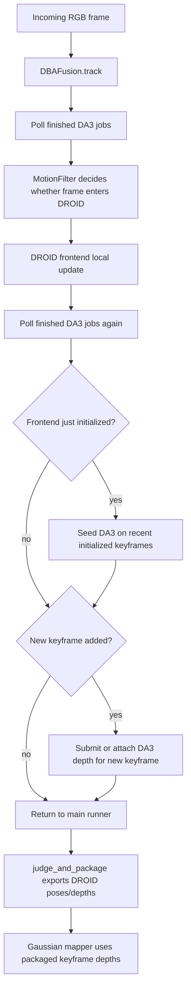
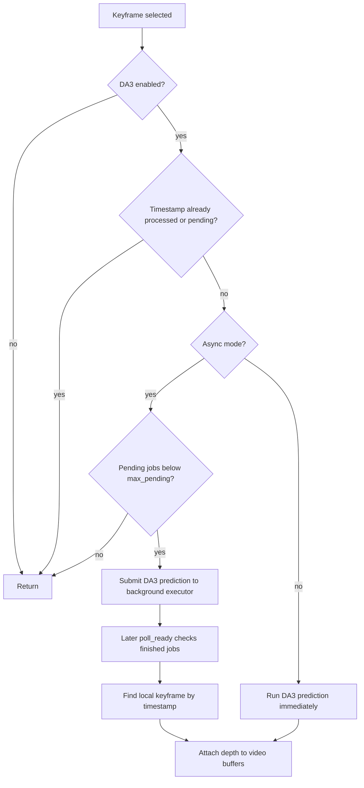
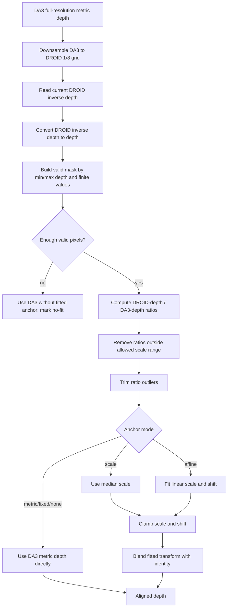
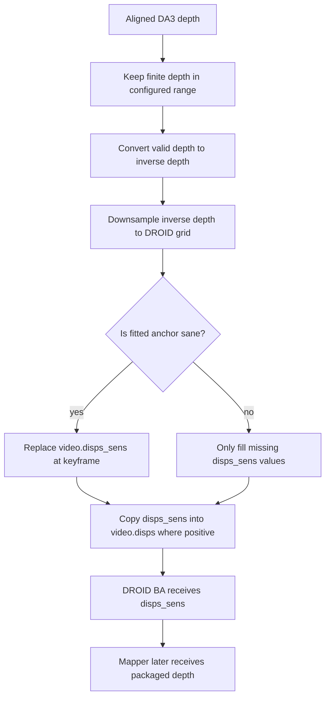
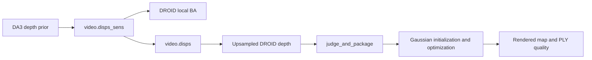
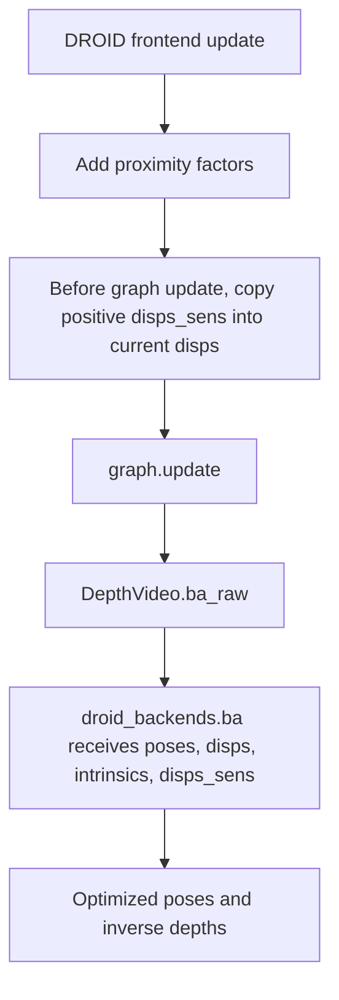

# DA3 Metric-Depth Prior Integration Flowchart and Explanation

This document summarizes how DA3 is integrated into the DPT-LSG tracking and
mapping pipeline. The method should be described as a conservative metric-depth
prior integration. DA3 does not replace DROID-SLAM's motion estimator; instead,
it writes bounded inverse-depth priors into DROID's existing sensor-depth
channel and lets the original bundle-adjustment backend consume them.

## Code Entry Points

| Role | File |
|---|---|
| Tracker wrapper | `scripts/frontend/dbaf.py` |
| DA3 depth-prior module | `scripts/frontend/da3_depth_prior.py` |
| DROID frontend update | `scripts/frontend/dbaf_frontend.py` |
| DROID video/depth buffers | `scripts/frontend/depth_video.py` |
| Keyframe packaging for mapper | `scripts/vings_utils/middleware_utils.py` |
| Gaussian mapper | `scripts/gaussian/gaussian_model.py` |

## High-Level Flowchart

The integration is keyframe-oriented. DA3 is not executed on every raw video
frame. It is submitted for initialized keyframes and for newly accepted
keyframes. This limits runtime cost and avoids injecting depth into frames that
DROID has not accepted into the local optimization window.

## DA3 Prediction and Attachment Flow

In the conservative configuration, DA3 runs asynchronously with
`max_pending: 2`. This prevents DA3 from blocking the DROID frontend. The cost
is that the DA3 depth usually arrives after the current DROID update, so it
mainly affects later frontend updates and mapper input rather than immediately
correcting the current pose.

## Depth Alignment Flow

The alignment step makes DA3 conservative. DA3 predicts metric depth, but the
module still aligns it to the current DROID depth estimate before writing it
back. In the final conservative configs, the important settings are:

| Parameter | Conservative value |
|---|---:|
| `da3.min_depth` | `0.5` |
| `da3.max_depth` | `80.0` |
| `da3.anchor_mode` | `scale` |
| `da3.align_min_pixels` | `512` |
| `da3.align_trim` | `0.1` |
| `da3.align_min_scale` | `0.75` |
| `da3.align_max_scale` | `1.33` |
| `da3.align_min_shift` | `0.0` |
| `da3.align_max_shift` | `0.0` |
| `da3.align_blend` | `0.15` |
| `da3.require_sane_fit_for_replace` | `True` |

With `anchor_mode: scale`, the module estimates only a multiplicative scale.
The shift is fixed to zero. With `align_blend: 0.15`, the final scale is kept
close to identity, so DA3 can nudge DROID depth but cannot aggressively replace
the local geometry.

## Buffer Injection Flow

`video.disps_sens` is the key integration point. The DROID CUDA bundle
adjustment already accepts this sensor-depth tensor. DA3 therefore enters the
frontend without changing DROID's learned optical-flow/recurrent update
network.

The replacement rule is intentionally guarded:

1. If the fitted scale is valid and within the configured range, DA3 can replace
   the current sensor-depth prior for that keyframe.
2. If the fit is clamped, missing, unstable, or marked no-fit, DA3 only fills
   missing values and preserves existing valid priors.
3. After attachment, `video.disps` is refreshed wherever `video.disps_sens` is
   positive, so subsequent frontend and mapper stages can observe the prior.

## Where DA3 Affects the Pipeline

The strongest direct effect is usually on mapping. The mapper consumes the
depths exported from DROID's video buffers, and those buffers can include DA3
depth priors after attachment. Tracking can also benefit, but only when the DA3
prior is available before or during a DROID graph update. In the current
conservative asynchronous configuration, DA3 is deliberately prevented from
blocking the tracker, so the immediate pose-estimation effect is limited.

## DROID Frontend Consumption

This is why the DA3 method is a depth-prior integration rather than a new
tracker. DROID still decides keyframe acceptance, factor construction,
correlation updates, and pose/depth optimization. DA3 only supplies an
additional metric inverse-depth signal through the existing `disps_sens` path.

## Current Conservative Configuration

The final paper configuration uses the following DA3-related settings:

| Setting | Value |
|---|---|
| Model | `depth-anything/DA3METRIC-LARGE` |
| Checkpoint | `/home/server/VINGS_work/DPT-LSG/ckpts/da3_mars_lvig_hkairport_amtown01_head.pth` |
| Precision | `float16` |
| Process resolution | `560` |
| Resize policy | `upper_bound_resize` |
| Execution | Asynchronous |
| Max pending jobs | `2` |
| Seed initialized window | `True` |
| Max seed keyframes | `4` |
| Frontend refine updates | `0` |
| Canonical focal scaling | `True` |
| Depth range | `0.5 m` to `80.0 m` |
| Alignment mode | Scale-only |
| Scale clamp | `0.75` to `1.33` |
| Blend | `0.15` |
| Replace existing depth | `True`, only when the fit is sane |

This configuration is chosen for stability on UAV videos. Water, sky, motion
blur, and large altitude changes can make monocular depth unreliable in some
frames. A small blend weight and tight scale clamp let DA3 improve the depth
used by mapping while limiting the risk of injecting a wrong scale into DROID's
local optimization.

## Paper-Friendly Explanation

We integrate DA3 as a conservative metric depth prior for the DROID-SLAM
frontend. For each initialized or newly selected keyframe, DA3 predicts a
metric depth map using the RGB image and camera intrinsics. The predicted depth
is aligned to the current DROID depth estimate on the 1/8-resolution DROID grid
using a robust scale fit. The fitted scale is accepted only if enough valid
pixels are available and the result lies within a predefined scale range. The
aligned DA3 depth is then converted to inverse depth and written to DROID's
sensor-depth buffer, `disps_sens`. During DROID bundle adjustment, this buffer
acts as an additional depth prior while the original DROID network still
controls motion filtering, factor construction, and pose optimization.

This design avoids treating DA3 as a hard replacement for DROID depth. Instead,
DA3 is used to regularize metric scale and provide more stable depth for
Gaussian mapping. The final implementation uses asynchronous DA3 prediction and
a small alignment blend weight, which reduces runtime overhead and prevents
unstable depth estimates from corrupting tracking on challenging UAV scenes.
