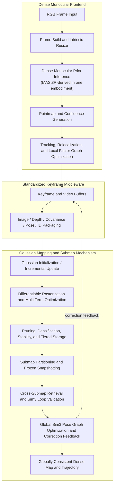
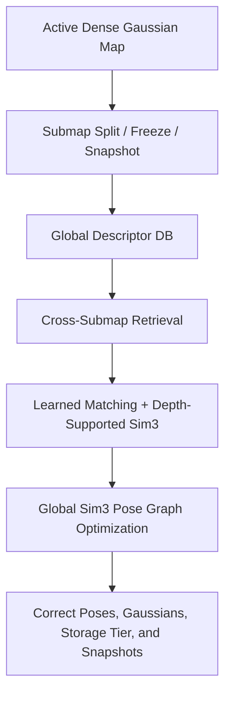

# Applicant Information

Title of the Invention: A Submap-Mechanism-Based Monocular Large-Scale Simultaneous Localization and Mapping Method, System, and Storage Medium

Applicant: `[To be completed]`

Inventors: `[To be completed]`

Application Type: Invention

Note: This document is a technical patent draft derived from the current `DPT-LSG` codebase. Applicant, inventor, filing jurisdiction, legal normalization, claim strategy, and drawing formatting should be finalized with patent counsel.

## Abstract

The invention discloses a submap-mechanism-based monocular large-scale simultaneous localization and mapping method, system, and storage medium, belonging to the technical field of monocular visual simultaneous localization and mapping, dense three-dimensional reconstruction, and differentiable scene modeling. The invention uses a monocular RGB sequence as input, performs dense monocular geometric prior inference to obtain a pointmap and confidence, performs local tracking and factor-graph pose estimation, converts frontend outputs into a standardized keyframe packet containing image, depth, uncertainty, pose, timestamp, and global keyframe identity, and drives an online Gaussian scene mapping backend. The backend maintains a live differentiable Gaussian map, executes RGB-depth-geometric joint optimization, and performs pruning, densification, stability control, and CPU/GPU tiered storage. For large scenes, the invention partitions the global mapping process into active and frozen submaps, constructs a global keyframe descriptor database, retrieves cross-submap loop candidates, validates the candidates by learned image matching and depth-supported Sim(3) estimation, performs global Sim(3) pose graph optimization, and feeds the corrected geometry and pose back to frontend buffers, live Gaussian primitives, and frozen submap snapshots, thereby obtaining a globally consistent monocular large-scale trajectory and dense map. In a preferred embodiment, the dense monocular geometric prior module is MASt3R-SLAM-derived, but the inventive core lies in the coupling between the monocular dense prior, the standardized keyframe middleware, the Gaussian mapping process, and the submap mechanism for scalable global correction.

## Abstract with Figure

Figure 1 is a schematic flow diagram of the submap-mechanism-based monocular large-scale SLAM system.

## Claims

1. A submap-mechanism-based monocular large-scale simultaneous localization and mapping method, characterized by comprising the following steps:

   S1: acquiring a monocular RGB image sequence $\{I_t\}_{t=1}^T$ and corresponding camera intrinsic matrices $\{K_t\}_{t=1}^T$, resizing a current frame $I_t$ to obtain $I_t'$, and resizing the intrinsic matrix according to

   $$
   K_t'=
   \begin{bmatrix}
   s_x f_x & 0 & s_x c_x+\Delta_x \\
   0 & s_y f_y & s_y c_y+\Delta_y \\
   0 & 0 & 1
   \end{bmatrix},
   $$

   wherein $s_x$ and $s_y$ are horizontal and vertical resize factors and $\Delta_x,\Delta_y$ are crop offsets, and performing dense monocular geometric prior inference

   $$
   (P_t,C_t)=\mathcal{F}_\theta(I_t'),
   $$

   wherein $P_t(u)=[X_t(u),Y_t(u),Z_t(u)]^\top$ is a pointmap at pixel $u$ and $C_t(u)$ is a confidence value;

   S2: representing a current camera state by a similarity transform

   $$
   T_t^{\mathrm{sim3}}=
   \begin{bmatrix}
   s_t R_t & t_t \\
   0 & 1
   \end{bmatrix},
   $$

   extracting scale and Euclidean pose according to

   $$
   s_t=\left|\det\!\left(T_{t,1:3,1:3}^{\mathrm{sim3}}\right)\right|^{1/3},
   \qquad
   \bar R_t=\frac{T_{t,1:3,1:3}^{\mathrm{sim3}}}{s_t},
   $$

   and computing depth and uncertainty according to

   $$
   D_t(u)=s_t Z_t(u),
   \qquad
   \Sigma_t(u)=\operatorname{clip}\!\left(\frac{\alpha}{\max(C_t(u),\varepsilon)}s_t^2,\Sigma_{\min},\Sigma_{\max}\right),
   $$

   and further constructing a valid-pixel mask

   $$
   M_t(u)=\mathbf{1}\!\left[D_{\min}<D_t(u)<D_{\max}\ \wedge\ \Sigma_t(u)\le\tau_\Sigma\ \wedge\ D_t(u),\Sigma_t(u)\in\mathbb{R}\right];
   $$

   S3: performing local tracking and relocalization-aware factor-graph optimization by solving

   $$
   \mathcal{X}_t^\ast=
   \arg\min_{\mathcal{X}_t}
   \left(
   \sum_{(i,j)\in\mathcal{E}_t^{\mathrm{temp}}}\rho\!\left(\left\|r_{ij}^{\mathrm{ray}}(\mathcal{X}_t)\right\|_{W_{ij}}^2\right)
   +
   \sum_{(i,k)\in\mathcal{E}_t^{\mathrm{relocal}}}\rho\!\left(\left\|r_{ik}^{\mathrm{relocal}}(\mathcal{X}_t)\right\|_{W_{ik}}^2\right)
   \right),
   $$

   wherein $\mathcal{E}_t^{\mathrm{temp}}$ denotes temporal tracking edges, $\mathcal{E}_t^{\mathrm{relocal}}$ denotes relocalization edges, $\rho(\cdot)$ denotes a robust kernel, and $\mathcal{X}_t$ denotes pose variables of a local keyframe set, and packaging an optimized keyframe into a standardized keyframe packet

   $$
   \mathcal{B}_t=\left\{I_t',D_t,\Sigma_t,T_t^{c2w},M_t,\tau_t,g_t,K_t'\right\},
   $$

   wherein $T_t^{c2w}$ is a camera-to-world pose, $\tau_t$ is a timestamp, and $g_t$ is a global keyframe identity;

   S4: maintaining a Gaussian scene representation

   $$
   \mathcal{G}_t=\left\{\gamma_n\right\}_{n=1}^{N_t},
   \qquad
   \gamma_n=(\mu_n,q_n,a_n,o_n,c_n,\kappa_n,b_n),
   $$

   wherein $\mu_n\in\mathbb{R}^3$ is a Gaussian center, $q_n$ is a rotation parameter, $a_n$ is a scale parameter, $o_n$ is opacity, $c_n$ is color, $\kappa_n$ is an ownership keyframe index, and $b_n$ is a birth keyframe index, and initializing or updating the Gaussian scene representation by backprojecting valid pixels according to

   $$
   x_t(u)=D_t(u)K_t'^{-1}\tilde u,
   \qquad
   \mu_t(u)=R_t x_t(u)+t_t,
   $$

   wherein $\tilde u=[u,v,1]^\top$, and rendering a current Gaussian map according to

   $$
   (\hat I_t,\hat D_t,\hat A_t,\hat N_t)=\mathcal{R}(\mathcal{G}_t,T_t^{w2c},K_t'),
   $$

   and optimizing the Gaussian scene representation according to

   $$
   \mathcal{L}_t=
   \lambda_{\mathrm{rgb}}\mathcal{L}_{\mathrm{rgb}}
   +\lambda_d\mathcal{L}_d
   +\lambda_a\mathcal{L}_a
   +\lambda_n\mathcal{L}_n,
   $$

   wherein

   $$
   \mathcal{L}_{\mathrm{rgb}}=\sum_u M_t(u)\|\hat I_t(u)-I_t'(u)\|_1,
   $$

   $$
   \mathcal{L}_d=\sum_u M_t(u)\frac{|\hat D_t(u)-D_t(u)|}{\Sigma_t(u)+\varepsilon},
   $$

   $$
   \mathcal{L}_a=\sum_u M_t(u)|\hat A_t(u)-1|,
   $$

   $$
   \mathcal{L}_n=\sum_u M_t(u)\left(1-\langle \hat N_t(u),N_t^{\mathrm{surf}}(u)\rangle\right),
   $$

   and updating Gaussian parameters according to

   $$
   \Theta_{t+1}=\Theta_t-\beta\nabla_{\Theta_t}\mathcal{L}_t;
   $$

   S5: organizing the Gaussian scene representation by a memory-tiering rule

   $$
   \delta_i=\left\|\operatorname{trans}\!\left((T_t^{c2w})^{-1}T_i^{c2w}\right)\right\|_2,
   $$

   $$
   \mathcal{G}_t^{\mathrm{gpu}}=\{\gamma_n\mid \delta_{\kappa_n}\le\tau_{\mathrm{mem}}\},
   \qquad
   \mathcal{G}_t^{\mathrm{cpu}}=\{\gamma_n\mid \delta_{\kappa_n}>\tau_{\mathrm{mem}}\},
   $$

   so that near-field Gaussian primitives are kept in GPU memory and far-field Gaussian primitives are migrated to CPU memory;

   S6: partitioning the mapping process into submaps

   $$
   \mathcal{S}_k=(\mathcal{V}_k,\mathcal{G}_k,\Omega_k,\bar\phi_k),
   $$

   wherein $\mathcal{V}_k$ is a keyframe set of submap $k$, $\mathcal{G}_k$ is a Gaussian set of submap $k$, $\Omega_k$ is a frozen snapshot state, and $\bar\phi_k$ is a submap descriptor, and splitting an active submap when

   $$
   |\mathcal{V}_k|\ge N_{\max}
   \quad \lor \quad
   \sum_{i=2}^{|\mathcal{V}_k|}\|p_i-p_{i-1}\|_2\ge L_{\max},
   $$

   wherein $p_i$ is a translation component of a keyframe pose;

   S7: computing a keyframe descriptor

   $$
   \phi_i=\operatorname{norm}\!\left(
   \left[
   \operatorname{vec}(P(I_i)),
   \operatorname{vec}(\nabla_x \bar P(I_i)),
   \operatorname{vec}(\nabla_y \bar P(I_i))
   \right]
   \right),
   $$

   and computing a submap descriptor according to

   $$
   \bar\phi_k=\operatorname{norm}\!\left(\frac{1}{|\mathcal{V}_k|}\sum_{i\in\mathcal{V}_k}\phi_i\right),
   $$

   retrieving cross-submap loop candidates by descriptor similarity

   $$
   s_{\mathrm{ret}}(q,k)=\phi_q^\top \bar\phi_k,
   \qquad
   s_{\mathrm{ret}}(q,j)=\phi_q^\top \phi_j;
   $$

   S8: for a retrieved reference-query pair, reconstructing matched three-dimensional points from depth according to

   $$
   x_r^{(m)}=d_r(p_r^{(m)})K_r^{-1}\tilde p_r^{(m)},
   \qquad
   x_q^{(m)}=d_q(p_q^{(m)})K_q^{-1}\tilde p_q^{(m)},
   $$

   estimating a relative similarity transform according to

   $$
   (R_{qr},t_{qr},s_{qr})=
   \arg\min_{R\in SO(3),\,t\in\mathbb{R}^3,\,s>0}
   \sum_{m\in\mathcal{I}}
   \left\|x_q^{(m)}-\left(sRx_r^{(m)}+t\right)\right\|_2^2,
   $$

   constructing a validation region

   $$
   \Omega_{\mathrm{val}}=
   \left\{
   u\ \middle|\ \hat A_q(u)>\tau_{\mathrm{acc}}
   \ \wedge\
   \hat D_q(u)>0
   \right\},
   $$

   and accepting a loop only when

   $$
   |\mathcal{I}|\ge N_{\min},
   \qquad
   e_{\mathrm{photo}}=
   \frac{1}{|\Omega_{\mathrm{val}}|}
   \sum_{u\in\Omega_{\mathrm{val}}}
   |\hat I_q^{\mathrm{gray}}(u)-I_q^{\mathrm{gray}}(u)|
   <\tau_{\mathrm{photo}},
   $$

   and

   $$
   \|\hat p_q-p_q\|_2<\tau_{\mathrm{jump}};
   $$

   wherein $\hat p_q$ and $p_q$ are translation components of a predicted query pose and a current query pose, respectively;

   S9: constructing a global Sim(3) graph with adjacency edges, overlap edges, and accepted loop edges, and solving

   $$
   \{S_i^\ast\}=
   \arg\min_{\{S_i\}}
   \sum_{(i,j)\in\mathcal{E}_{\mathrm{adj}}\cup\mathcal{E}_{\mathrm{ov}}\cup\mathcal{E}_{\mathrm{loop}}}
   \left\|
   \log\!\left(
   Z_{ij}^{-1}S_i^{-1}S_j
   \right)
   \right\|_{\Lambda_{ij}}^2,
   $$

   wherein $S_i$ is a Sim(3) node state, $Z_{ij}$ is an edge measurement, and $\Lambda_{ij}$ is a weighting matrix, and computing a correction transform

   $$
   \Delta_i=S_i^\ast(S_i^{\mathrm{old}})^{-1},
   $$

   and applying the correction transform to frontend poses, live Gaussian primitives, CPU-stored Gaussian primitives, and frozen submap snapshots according to

   $$
   \mu_n \leftarrow s_{\Delta_i}R_{\Delta_i}\mu_n+t_{\Delta_i},
   \qquad
   q_n \leftarrow R_{\Delta_i}\otimes q_n,
   \qquad
   a_n \leftarrow a_n+\log s_{\Delta_i},
   $$

   thereby obtaining a globally consistent monocular large-scale trajectory and dense map.

2. The method according to claim 1, characterized in that, in step S2, the Euclidean rotation matrix is obtained by singular-value projection

   $$
   \bar R_t=U_t\Lambda_tV_t^\top,
   \qquad
   R_t=U_t
   \operatorname{diag}\!\left(1,1,\det(U_tV_t^\top)\right)
   V_t^\top,
   $$

   so that the scaled rotation part of the similarity transform is projected onto $SO(3)$.

3. The method according to claim 1, characterized in that, the standardized keyframe packet further satisfies

   $$
   \mathcal{B}_t=
   \left\{
   I_t',D_t,\Sigma_t,M_t,T_t^{c2w},\tau_t,g_t,K_t',\Pi_t
   \right\},
   $$

   wherein $\Pi_t$ is an index mapping between a packet order and an original frame order, and the uncertainty term $\Sigma_t$ is directly propagated from the frontend confidence map rather than being independently estimated by the mapping backend.

4. The method according to claim 1, characterized in that, in step S4, Gaussian initialization further satisfies

   $$
   a_n=\log\!\left(\sqrt{\max(d_n,\delta)}\right),
   \qquad
   o_n=\sigma^{-1}(o_0),
   $$

   wherein $d_n$ is a local point-spacing estimate, $\delta$ is a lower bound, $o_0$ is an initial opacity prior, and $\sigma^{-1}(\cdot)$ is an inverse sigmoid, and incremental Gaussian generation is performed on a residual region

   $$
   \Omega_t^{\mathrm{new}}=
   \left\{
   u\ \middle|\
   \hat A_t(u)<\tau_A
   \ \lor\
   \|\hat I_t(u)-I_t'(u)\|_1>\tau_I
   \right\}.
   $$

5. The method according to claim 1, characterized in that, in steps S4 and S5, each Gaussian primitive maintains local and global score states

   $$
   \ell_n=[\ell_n^{\mathrm{imp}},\ell_n^{\mathrm{err}}],
   \qquad
   g_n=[g_n^{\mathrm{imp}},g_n^{\mathrm{err}}],
   $$

   which are updated according to

   $$
   \ell_n^{\mathrm{imp}}\leftarrow \ell_n^{\mathrm{imp}}+s_n^{\mathrm{imp}},
   \qquad
   g_n^{\mathrm{imp}}\leftarrow g_n^{\mathrm{imp}}+s_n^{\mathrm{imp}},
   \qquad
   \ell_n^{\mathrm{err}}\leftarrow \max(\ell_n^{\mathrm{err}},s_n^{\mathrm{err}}),
   $$

   and a stability label $\chi_n$ is updated according to

   $$
   \chi_n \leftarrow 1 \quad \text{if} \quad \ell_n^{\mathrm{imp}}<\varepsilon_{\mathrm{stable}},
   $$

   $$
   \chi_n \leftarrow 0 \quad \text{if} \quad \ell_n^{\mathrm{err}}>\tau_{\mathrm{unstable}}
   \ \wedge\
   \ell_n^{\mathrm{imp}}>\tau_{\mathrm{active}},
   $$

   and pruning is performed on a set

   $$
   \mathcal{P}_t=
   \left\{
   n\ \middle|\
   \iota_n\in(\tau_{\min}^{\mathrm{imp}},\tau_{\max}^{\mathrm{imp}})
   \ \wedge\
   \chi_n=0
   \right\},
   $$

   while splitting or densification is performed on a set

   $$
   \mathcal{D}_t=
   \left\{
   n\ \middle|\
   \ell_n^{\mathrm{err}}>\tau_{\mathrm{split}}
   \ \wedge\
   \chi_n=0
   \right\}.
   $$

6. The method according to claim 1, characterized in that, in steps S6 to S8, a frozen submap snapshot is stored as

   $$
   \Omega_k=
   \left\{
   \mathcal{G}_k^{\mathrm{gpu}},
   \mathcal{G}_k^{\mathrm{cpu}},
   \mathcal{A}_k
   \right\},
   $$

   wherein $\mathcal{A}_k$ comprises keyframe association, score state, ownership identifiers, and submap metadata, and the retrieved loop measurement is inserted into the global graph only when a similarity-estimation inlier mask satisfies

   $$
   \sum_m \mathbf{1}[m\in\mathcal{I}] \ge N_{\min}.
   $$

7. The method according to claim 1, characterized in that, in step S9, the global graph uses at least two edge classes with different uncertainty models,

   $$
   \Lambda_{ij}=
   \begin{cases}
   \Lambda_{\mathrm{adj}}, & (i,j)\in\mathcal{E}_{\mathrm{adj}}, \\
   \Lambda_{\mathrm{ov}}, & (i,j)\in\mathcal{E}_{\mathrm{ov}}, \\
   \Lambda_{\mathrm{loop}}, & (i,j)\in\mathcal{E}_{\mathrm{loop}},
   \end{cases}
   $$

   and the corrected submap state is fed back by applying $\Delta_i$ both to the tracking-side pose buffers and to the mapping-side Gaussian parameters associated with creator or ownership index $i$.

8. A submap-mechanism-based monocular large-scale simultaneous localization and mapping system, characterized by comprising:

   a dense monocular geometric prior module configured to execute step S1 of claim 1;

   a local tracking and standardized keyframe packaging module configured to execute step S2 and step S3 of claim 1;

   a Gaussian mapping and memory-tiering module configured to execute step S4 and step S5 of claim 1; and

   a submap partitioning, loop validation, and global Sim(3) correction module configured to execute step S6 to step S9 of claim 1.

9. A non-transitory computer-readable storage medium storing computer instructions which, when executed by a processor, cause the processor to perform the method according to any one of claims 1 to 7.

## Technical Field

The present invention relates to the technical field of monocular visual simultaneous localization and mapping, dense three-dimensional scene reconstruction, and differentiable scene representation, and in particular to a submap-mechanism-based monocular large-scale SLAM method and system that integrates a monocular dense geometric prior frontend, a standardized keyframe middleware, an online Gaussian mapping backend, and a submap-based global Sim(3) optimization mechanism.

## Background Art

Monocular SLAM is widely used in robotics, embodied intelligence, augmented reality, mobile reconstruction, and autonomous perception. Existing monocular systems generally fall into two categories. A first category focuses on trajectory estimation by sparse features or indirect bundle adjustment, but often lacks dense geometry and strong rendering consistency. A second category focuses on dense monocular geometry inference or neural scene representation, but often lacks scalable large-scene organization, stable global correction, and efficient memory control.

Recent monocular dense geometry methods represented by MASt3R and MASt3R-SLAM-derived pipelines provide pointmap-confidence predictions with richer local geometry than traditional sparse features. However, merely attaching dense monocular inference to a tracking frontend is insufficient to solve the following problems:

- long-horizon monocular drift and scale inconsistency;
- unstable dense loop validation in large scenes;
- uncontrolled growth of dense map primitives;
- tight coupling between frontend outputs and backend mapping inputs; and
- lack of a scalable mechanism for freezing, retrieving, and globally correcting dense submaps.

Meanwhile, Gaussian-splatting-based mapping provides an efficient differentiable dense scene representation, but a single ever-growing Gaussian map remains difficult to maintain over long monocular trajectories. Therefore, the key technical challenge is not only how to infer dense geometry from monocular input, but how to organize, validate, and globally correct a large dense map by a submap mechanism while keeping frontend and backend mathematically consistent.

The invention therefore aims to provide a submap-mechanism-based monocular large-scale SLAM framework in which:

- a dense monocular geometric prior supplies pointmap-confidence observations;
- a standardized keyframe packet decouples tracking from mapping;
- a Gaussian backend performs dense differentiable map optimization;
- a memory-tiering rule supports large-scene deployment; and
- a submap mechanism enables frozen snapshots, cross-submap retrieval, depth-supported Sim(3) validation, and global correction feedback.

## Summary of the Invention

### Technical Problem

The invention aims to solve at least one of the following technical problems:

- how to transform monocular dense geometric priors into a backend-consumable SLAM state with explicit uncertainty;
- how to jointly optimize image, depth, and geometric consistency in online dense monocular mapping;
- how to prevent dense map growth from destroying runtime and memory scalability;
- how to define a mathematically consistent submap mechanism for long monocular sequences; and
- how to propagate global Sim(3) corrections into both tracking buffers and dense Gaussian assets.

### Technical Solution

To solve the above problems, the invention provides a submap-mechanism-based monocular large-scale SLAM framework. In a preferred embodiment, the frontend adopts a MASt3R-SLAM-derived dense monocular prior module, but the inventive structure is defined by the following coupled state evolution:

$$
\mathcal{Z}_t=(I_t,K_t)
\rightarrow
\mathcal{P}_t=(P_t,C_t)
\rightarrow
\mathcal{B}_t=(I_t',D_t,\Sigma_t,T_t^{c2w},M_t,\tau_t,g_t,K_t')
\rightarrow
\mathcal{G}_t
\rightarrow
\{\mathcal{S}_k\}
\rightarrow
\{S_i^\ast\}.
$$

In one embodiment, the technical solution comprises:

S1. A monocular frame is resized, an intrinsic matrix is synchronously resized, and a dense pointmap-confidence prior is inferred.

S2. A local tracking graph estimates the current pose and exports a standardized keyframe packet with depth and confidence-derived covariance.

S3. A Gaussian map is initialized or updated by backprojection, differentiable rasterization, and joint RGB-depth-normal optimization.

S4. Gaussian primitives are stabilized, pruned, densified, and distributed between GPU and CPU memory according to a distance rule.

S5. An active dense map is partitioned into submaps; completed submaps are frozen as snapshots with overlap continuity.

S6. A global descriptor database retrieves cross-submap candidates; a learned matcher and depth-supported Sim(3) estimator validate candidate loops.

S7. A global Sim(3) pose graph optimizes adjacency, overlap, and loop constraints, and the resulting corrections are applied to frontend poses, live Gaussians, storage-tier Gaussians, and frozen snapshots.

### Beneficial Effects

Compared with the prior art, the invention has the following beneficial effects:

1. The invention defines the core contribution around a submap mechanism rather than a single frontend model, thereby making the large-scale monocular SLAM architecture more general and more defensible as a system invention.
2. Dense monocular pointmap-confidence priors are converted into depth-uncertainty packets, so confidence is mathematically propagated into the mapping stage instead of being discarded.
3. The standardized keyframe middleware decouples tracking and mapping while preserving pose, uncertainty, keyframe identity, and temporal ordering.
4. The Gaussian backend enables dense online optimization by differentiable rendering instead of purely symbolic map accumulation.
5. GPU/CPU tiered Gaussian storage improves memory scalability for long trajectories and large scenes.
6. The submap mechanism makes it possible to freeze local dense maps, retrieve cross-submap candidates efficiently, and validate them by depth-supported Sim(3) constraints.
7. Global Sim(3) correction is applied not only to graph states, but also to dense Gaussian assets and frontend buffers, thereby improving end-to-end consistency.

## Brief Description of the Drawings

Figure 1 is a schematic diagram of the overall submap-mechanism-based monocular large-scale SLAM pipeline.

Figure 2 is a schematic diagram of the standardized keyframe middleware and confidence-to-uncertainty conversion process.

Figure 3 is a schematic diagram of submap partitioning, cross-submap retrieval, Sim(3) loop validation, and global correction feedback.

## Detailed Description

The technical solution of the present invention is described below in a mathematically structured manner. The embodiments are used to explain the invention and are not intended to limit the protection scope of the invention.

### Embodiment 1: System State and Notation

Let the monocular input stream be

$$
\mathcal{I}=\{(I_t,K_t)\}_{t=1}^T,
\qquad
I_t\in[0,1]^{H_t\times W_t\times 3},
\qquad
K_t\in\mathbb{R}^{3\times 3}.
$$

Let the system state at time $t$ be

$$
\mathcal{X}_t=
\left(
\mathcal{F}_t,
\mathcal{B}_t,
\mathcal{G}_t,
\mathcal{M}_t,
\mathcal{S}_t,
\mathcal{Y}_t
\right),
$$

where:

- $\mathcal{F}_t$ denotes frontend local tracking state;
- $\mathcal{B}_t$ denotes a standardized keyframe packet;
- $\mathcal{G}_t$ denotes a live Gaussian map;
- $\mathcal{M}_t$ denotes a tiered memory state;
- $\mathcal{S}_t$ denotes a submap collection; and
- $\mathcal{Y}_t$ denotes a global Sim(3) graph state.

In the preferred embodiment, the dense monocular prior module is MASt3R-SLAM-derived. However, the inventive center is the coupled evolution of $(\mathcal{B}_t,\mathcal{G}_t,\mathcal{M}_t,\mathcal{S}_t,\mathcal{Y}_t)$ under a submap mechanism.

### Embodiment 2: Monocular Dense Prior and Frontend Observation Model

For each frame $I_t$, the system computes a resized frame $I_t'$ and resized intrinsic matrix $K_t'$:

$$
I_t'=\mathcal{R}_\eta(I_t),
$$

$$
K_t'=
\begin{bmatrix}
s_x f_x & 0 & s_x c_x+\Delta_x \\
0 & s_y f_y & s_y c_y+\Delta_y \\
0 & 0 & 1
\end{bmatrix}.
$$

The dense monocular prior module outputs:

$$
(P_t,C_t)=\mathcal{F}_\theta(I_t'),
$$

with

$$
P_t(u)=
\begin{bmatrix}
X_t(u)\\Y_t(u)\\Z_t(u)
\end{bmatrix},
\qquad
C_t(u)\in\mathbb{R}_{>0}.
$$

The current pose is represented by a similarity state

$$
T_t^{\mathrm{sim3}}=
\begin{bmatrix}
s_t R_t & t_t\\
0 & 1
\end{bmatrix},
$$

with scale

$$
s_t=\left|\det(T_{t,1:3,1:3}^{\mathrm{sim3}})\right|^{1/3}.
$$

Let

$$
\bar R_t=\frac{T_{t,1:3,1:3}^{\mathrm{sim3}}}{s_t}
=U_t\Lambda_tV_t^\top.
$$

Then the Euclidean rotation is projected as

$$
R_t=
U_t
\operatorname{diag}(1,1,\det(U_tV_t^\top))
V_t^\top.
$$

Thus, a monocular dense prior is converted into Euclidean mapping variables by

$$
D_t(u)=s_t Z_t(u),
$$

$$
\Sigma_t(u)=\operatorname{clip}\!\left(\frac{\alpha}{\max(C_t(u),\varepsilon)}s_t^2,\Sigma_{\min},\Sigma_{\max}\right),
$$

$$
M_t(u)=\mathbf{1}\!\left[D_{\min}<D_t(u)<D_{\max}\ \wedge\ \Sigma_t(u)\le\tau_\Sigma\right].
$$

### Embodiment 3: Local Tracking and Standardized Keyframe Middleware

Let the local factor graph at time $t$ be

$$
\mathcal{G}_t^{\mathrm{loc}}=
(\mathcal{V}_t^{\mathrm{loc}},\mathcal{E}_t^{\mathrm{temp}}\cup\mathcal{E}_t^{\mathrm{relocal}}).
$$

The local pose state is estimated by

$$
\mathcal{X}_t^\ast=
\arg\min_{\mathcal{X}_t}
\left(
\sum_{(i,j)\in\mathcal{E}_t^{\mathrm{temp}}}
\rho(\|r_{ij}^{\mathrm{ray}}\|_{W_{ij}}^2)
\;+\;
\sum_{(i,k)\in\mathcal{E}_t^{\mathrm{relocal}}}
\rho(\|r_{ik}^{\mathrm{relocal}}\|_{W_{ik}}^2)
\right).
$$

The frontend state is then converted into a standardized keyframe packet

$$
\mathcal{B}_t=
\left\{
I_t',
D_t,
\Sigma_t,
M_t,
T_t^{c2w},
\tau_t,
g_t,
K_t',
\Pi_t
\right\},
$$

where $\Pi_t$ maps packet order to source-frame order. This packet is tracker-agnostic: any frontend that produces the tuple $\mathcal{B}_t$ can drive the same backend.

### Embodiment 4: Gaussian Scene State and Mapping Objective

The live dense map is represented by

$$
\mathcal{G}_t=\{\gamma_n\}_{n=1}^{N_t},
\qquad
\gamma_n=(\mu_n,q_n,a_n,o_n,c_n,\kappa_n,b_n).
$$

For a valid pixel $u$, the backprojected camera-space point is

$$
x_t(u)=D_t(u)K_t'^{-1}\tilde u,
\qquad
\tilde u=[u,v,1]^\top,
$$

and its world-space initialization is

$$
\mu_t(u)=R_t x_t(u)+t_t.
$$

The initial Gaussian scale and opacity may be parameterized as

$$
a_n=\log\!\left(\sqrt{\max(d_n,\delta)}\right),
\qquad
o_n=\sigma^{-1}(o_0),
$$

where $d_n$ is a local point-spacing statistic.

Rendering is defined by

$$
(\hat I_t,\hat D_t,\hat A_t,\hat N_t)=\mathcal{R}(\mathcal{G}_t,T_t^{w2c},K_t').
$$

The mapping loss is

$$
\mathcal{L}_t=
\lambda_{\mathrm{rgb}}\mathcal{L}_{\mathrm{rgb}}
+\lambda_d\mathcal{L}_d
+\lambda_a\mathcal{L}_a
+\lambda_n\mathcal{L}_n,
$$

with

$$
\mathcal{L}_{\mathrm{rgb}}=
\sum_u M_t(u)\|\hat I_t(u)-I_t'(u)\|_1,
$$

$$
\mathcal{L}_d=
\sum_u M_t(u)\frac{|\hat D_t(u)-D_t(u)|}{\Sigma_t(u)+\varepsilon},
$$

$$
\mathcal{L}_a=
\sum_u M_t(u)|\hat A_t(u)-1|,
$$

$$
\mathcal{L}_n=
\sum_u M_t(u)\left(1-\langle \hat N_t(u),N_t^{\mathrm{surf}}(u)\rangle\right).
$$

The Gaussian parameter vector $\Theta_t$ is optimized by

$$
\Theta_{t+1}=\Theta_t-\beta\nabla_{\Theta_t}\mathcal{L}_t.
$$

New Gaussians are inserted from a residual region

$$
\Omega_t^{\mathrm{new}}=
\left\{
u\ \middle|\
\hat A_t(u)<\tau_A
\ \lor\
\|\hat I_t(u)-I_t'(u)\|_1>\tau_I
\right\}.
$$

### Embodiment 5: Stability Control, Pruning, Densification, and Memory Tiering

Each Gaussian maintains local and global scores:

$$
\ell_n=[\ell_n^{\mathrm{imp}},\ell_n^{\mathrm{err}}],
\qquad
g_n=[g_n^{\mathrm{imp}},g_n^{\mathrm{err}}].
$$

Given per-iteration scores $s_n^{\mathrm{imp}}$ and $s_n^{\mathrm{err}}$, the updates are

$$
\ell_n^{\mathrm{imp}}\leftarrow \ell_n^{\mathrm{imp}}+s_n^{\mathrm{imp}},
\qquad
g_n^{\mathrm{imp}}\leftarrow g_n^{\mathrm{imp}}+s_n^{\mathrm{imp}},
$$

$$
\ell_n^{\mathrm{err}}\leftarrow \max(\ell_n^{\mathrm{err}},s_n^{\mathrm{err}}).
$$

Let $\chi_n\in\{0,1\}$ be a stability indicator. One implementation uses

$$
\chi_n \leftarrow 1 \quad \text{if} \quad \ell_n^{\mathrm{imp}}<\varepsilon_{\mathrm{stable}},
$$

$$
\chi_n \leftarrow 0 \quad \text{if} \quad
\ell_n^{\mathrm{err}}>\tau_{\mathrm{unstable}}
\ \wedge\
\ell_n^{\mathrm{imp}}>\tau_{\mathrm{active}}.
$$

Pruning and densification are then defined on

$$
\mathcal{P}_t=
\left\{
n\ \middle|\
\iota_n\in(\tau_{\min}^{\mathrm{imp}},\tau_{\max}^{\mathrm{imp}})
\ \wedge\
\chi_n=0
\right\},
$$

$$
\mathcal{D}_t=
\left\{
n\ \middle|\
\ell_n^{\mathrm{err}}>\tau_{\mathrm{split}}
\ \wedge\
\chi_n=0
\right\}.
$$

For large scenes, a keyframe-distance memory rule is used:

$$
\delta_i=
\left\|
\operatorname{trans}\!\left((T_t^{c2w})^{-1}T_i^{c2w}\right)
\right\|_2,
$$

$$
\mathcal{G}_t^{\mathrm{gpu}}=\{\gamma_n\mid \delta_{\kappa_n}\le\tau_{\mathrm{mem}}\},
\qquad
\mathcal{G}_t^{\mathrm{cpu}}=\{\gamma_n\mid \delta_{\kappa_n}>\tau_{\mathrm{mem}}\}.
$$

Therefore, the Gaussian map remains both incrementally trainable and scalable over long trajectories.

### Embodiment 6: Submap Partitioning and Frozen Snapshotting

The dense map is partitioned into submaps

$$
\mathcal{S}_k=(\mathcal{V}_k,\mathcal{G}_k,\Omega_k,\bar\phi_k),
$$

where $\Omega_k$ is the frozen snapshot state of submap $k$. An active submap is split when

$$
|\mathcal{V}_k|\ge N_{\max}
\quad \lor \quad
\sum_{i=2}^{|\mathcal{V}_k|}\|p_i-p_{i-1}\|_2\ge L_{\max}.
$$

Once a split is triggered, the active submap is frozen and serialized as

$$
\Omega_k=
\left\{
\mathcal{G}_k^{\mathrm{gpu}},
\mathcal{G}_k^{\mathrm{cpu}},
\mathcal{A}_k
\right\},
$$

where $\mathcal{A}_k$ stores bookkeeping data including keyframe association, ownership indices, score states, and other metadata. A set of overlap keyframes

$$
\mathcal{O}_k\subset\mathcal{V}_k
$$

may be copied into the next active submap to preserve continuity.

### Embodiment 7: Global Keyframe Database and Descriptor Retrieval

For each global keyframe $i$, the system computes a descriptor

$$
\phi_i=
\operatorname{norm}\!\left(
\left[
\operatorname{vec}(P(I_i)),
\operatorname{vec}(\nabla_x \bar P(I_i)),
\operatorname{vec}(\nabla_y \bar P(I_i))
\right]
\right),
$$

where $P(\cdot)$ denotes pooled appearance, $\bar P(\cdot)$ denotes a pooled grayscale image, and $\nabla_x,\nabla_y$ denote Sobel-type horizontal and vertical derivatives.

The submap descriptor is

$$
\bar\phi_k=\operatorname{norm}\!\left(\frac{1}{|\mathcal{V}_k|}\sum_{i\in\mathcal{V}_k}\phi_i\right).
$$

Given a query keyframe $q$, the retrieval scores are

$$
s_{\mathrm{ret}}(q,k)=\phi_q^\top\bar\phi_k,
\qquad
s_{\mathrm{ret}}(q,j)=\phi_q^\top\phi_j.
$$

The system first ranks frozen submaps by $s_{\mathrm{ret}}(q,k)$ and then ranks keyframes within the selected submaps by $s_{\mathrm{ret}}(q,j)$, thereby reducing large-scale loop search to a tractable candidate set.

### Embodiment 8: Learned Matching and Depth-Supported Sim(3) Estimation

Let a retrieved candidate pair consist of a reference keyframe $r$ from a frozen submap and a query keyframe $q$ from an active submap. A learned matcher returns correspondence pairs

$$
\mathcal{M}_{rq}=
\left\{
(p_r^{(m)},p_q^{(m)})
\right\}_{m=1}^{M}.
$$

Depth-backed three-dimensional points are reconstructed by

$$
x_r^{(m)}=d_r(p_r^{(m)})K_r^{-1}\tilde p_r^{(m)},
\qquad
x_q^{(m)}=d_q(p_q^{(m)})K_q^{-1}\tilde p_q^{(m)}.
$$

The relative similarity transform is estimated by

$$
(R_{qr},t_{qr},s_{qr})=
\arg\min_{R\in SO(3),\,t\in\mathbb{R}^3,\,s>0}
\sum_{m\in\mathcal{I}}
\|x_q^{(m)}-(sRx_r^{(m)}+t)\|_2^2,
$$

where $\mathcal{I}$ is an inlier set produced by robust estimation, such as RANSAC with Umeyama alignment.

The predicted query pose from the reference side is

$$
\hat T_q^{c2w}=T_r^{c2w}\circ S_{rq}^{-1}.
$$

The validation support is

$$
\Omega_{\mathrm{val}}=
\left\{
u\ \middle|\
\hat A_q(u)>\tau_{\mathrm{acc}}
\ \wedge\
\hat D_q(u)>0
\right\},
$$

and the photometric validation score is

$$
e_{\mathrm{photo}}=
\frac{1}{|\Omega_{\mathrm{val}}|}
\sum_{u\in\Omega_{\mathrm{val}}}
|\hat I_q^{\mathrm{gray}}(u)-I_q^{\mathrm{gray}}(u)|.
$$

The candidate is accepted iff

$$
|\mathcal{I}|\ge N_{\min},
\qquad
e_{\mathrm{photo}}<\tau_{\mathrm{photo}},
\qquad
\|\hat p_q-p_q\|_2<\tau_{\mathrm{jump}}.
$$

Here, $\hat p_q$ and $p_q$ denote translation components of the predicted query pose and the current query pose, respectively.

This embodiment turns large-scale loop detection from pure appearance retrieval into geometry-validated cross-submap closure.

### Embodiment 9: Global Sim(3) Graph Optimization and Correction Feedback

Let the global graph be

$$
\mathcal{Y}=(\mathcal{V},\mathcal{E}),
$$

with node state $S_i\in\mathrm{Sim}(3)$ and edge classes

$$
\mathcal{E}=
\mathcal{E}_{\mathrm{adj}}
\cup
\mathcal{E}_{\mathrm{ov}}
\cup
\mathcal{E}_{\mathrm{loop}}.
$$

Each edge $(i,j)$ carries a measurement $Z_{ij}\in\mathrm{Sim}(3)$. The optimization problem is

$$
\{S_i^\ast\}=
\arg\min_{\{S_i\}}
\sum_{(i,j)\in\mathcal{E}}
\left\|
\log\!\left(
Z_{ij}^{-1}S_i^{-1}S_j
\right)
\right\|_{\Lambda_{ij}}^2,
$$

with edge-dependent weights

$$
\Lambda_{ij}=
\begin{cases}
\Lambda_{\mathrm{adj}}, & (i,j)\in\mathcal{E}_{\mathrm{adj}}, \\
\Lambda_{\mathrm{ov}}, & (i,j)\in\mathcal{E}_{\mathrm{ov}}, \\
\Lambda_{\mathrm{loop}}, & (i,j)\in\mathcal{E}_{\mathrm{loop}}.
\end{cases}
$$

After optimization, the correction transform for node $i$ is

$$
\Delta_i=S_i^\ast(S_i^{\mathrm{old}})^{-1}
=
(R_{\Delta_i},t_{\Delta_i},s_{\Delta_i}).
$$

For each Gaussian primitive owned by node $i$, the corrected parameters become

$$
\mu_n \leftarrow s_{\Delta_i}R_{\Delta_i}\mu_n+t_{\Delta_i},
$$

$$
q_n \leftarrow R_{\Delta_i}\otimes q_n,
$$

$$
a_n \leftarrow a_n+\log s_{\Delta_i}.
$$

The same correction is applied to:

- live GPU Gaussians;
- CPU-tier Gaussians;
- frozen snapshot states; and
- frontend pose buffers used for subsequent tracking and packaging.

Hence, the global graph is not an external post-processing module; it is a correction field acting on the full coupled SLAM state.

### Embodiment 10: Preferred Frontend and Variants

In the preferred embodiment, the dense monocular geometric prior module is MASt3R-SLAM-derived, meaning that a MASt3R-style pointmap-confidence representation and a local factor-graph tracking process are used to generate $\mathcal{B}_t$. However, the invention is not limited to a particular monocular dense prior model. Any frontend that produces a packet

$$
\mathcal{B}_t=
\{I_t',D_t,\Sigma_t,M_t,T_t^{c2w},\tau_t,g_t,K_t',\Pi_t\}
$$

can be coupled to the same Gaussian mapping and submap mechanism, provided that the downstream equations of Embodiment 4 to Embodiment 9 remain valid.

Therefore, the core inventive concept is the following coupled mathematical system:

$$
\text{Monocular Dense Prior}
\;+\;
\text{Standardized Uncertainty-Aware Packet}
\;+\;
\text{Gaussian Dense Mapping}
\;+\;
\text{Submap Partition / Freeze / Retrieve / Correct Mechanism}.
$$

## Specification Drawings

### Figure 2. Standardized Keyframe Middleware

### Figure 3. Large-Scale Submap Optimization

