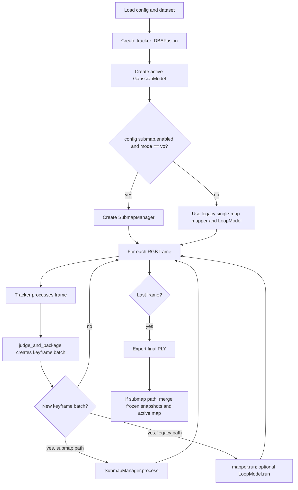

# Submap Mechanism Flowchart and Explanation

This document summarizes the current submap mechanism implemented in
`scripts/run.py` and `scripts/submap/submap_manager.py`. The mechanism is more
than a memory cache: it manages active and frozen Gaussian maps, global
keyframe ownership, cross-submap loop/seam constraints, and Sim(3) correction
propagation.

## Code Entry Points

| Role | File |
|---|---|
| Runtime dispatcher | `scripts/run.py` |
| Submap manager | `scripts/submap/submap_manager.py` |
| Global keyframe database | `scripts/submap/submap_manager.py` |
| Global Sim(3) graph | `scripts/submap/submap_manager.py` |
| LightGlue and Sim(3) loop validation | `scripts/loop/loop_detect.py` |
| Optional CPU/GPU storage tier | `scripts/storage/storage_manage.py` |
| Gaussian mapper | `scripts/gaussian/gaussian_model.py` |

## Runtime Flowchart



In the submap path, `Runner.run()` sends each valid `viz_out` batch to
`SubmapManager.process()`. This replaces the legacy single-map loop path for
`mode: vo`. Therefore, when submaps are enabled, loop handling is part of the
submap manager rather than a separate post-processing module.

## Per-Keyframe Submap Flow

```mermaid
flowchart TD
    A[SubmapManager.process] --> B[Store latest camera intrinsic]
    B --> C[Register keyframes]
    C --> C1[Add/update KeyframeRecord]
    C --> C2[Add/update Sim(3) graph node]
    C --> C3[Add adjacency edges]
    C --> C4[Update submap descriptor]

    C4 --> D[Run active Gaussian mapper]
    D --> E{Storage manager enabled and interval reached?}
    E -- yes --> F[Move stable/far Gaussians through storage tier]
    E -- no --> G
    F --> G[Try cross-submap seam bridge]

    G --> H[Try cross-submap loop]
    H --> I{Should split active submap?}
    I -- no --> J[Continue with same active submap]
    I -- yes --> K[Freeze active submap]
    K --> L[Save Gaussian snapshot to submaps/submap_XXXX.pt]
    L --> M[Start new active submap from overlap keyframes]
    M --> N[Bootstrap new GaussianModel from overlap depth]
    N --> J
```

The manager keeps a single live `GaussianModel` on the active submap. Older
submaps are serialized to disk as snapshots. This is the main memory-saving
idea: the current mapper only optimizes the active local Gaussian set, while
frozen submaps are reloaded only when needed for validation, correction, or
export.

## Key Data Structures

| Structure | Purpose |
|---|---|
| `SubmapRecord` | Stores a submap id, keyframe ids, overlap keyframes, frozen state, snapshot path, descriptor, and accepted loop/seam edges. |
| `KeyframeRecord` | Stores global keyframe id, timestamp, pose, image, depth, intrinsic, descriptor, owner submap, and all submap memberships. |
| `GlobalKeyframeDatabase` | Maintains keyframe records, submap membership, image descriptors, and retrieval candidates. |
| `GlobalSim3Graph` | Maintains Sim(3) nodes and adjacency, overlap, seam, and loop edges, then optimizes them with GTSAM. |
| `StorageManager` | Optionally moves stable Gaussian attributes between active GPU tensors and a storage tier. |

The owner-submap id is important. A keyframe may appear in multiple submaps due
to overlap, but each Gaussian is assigned to the keyframe that created it. At
export and correction time, the code filters Gaussians by owner to avoid
duplicating the same local geometry across submaps.

## Submap Split Flow

```mermaid
flowchart TD
    A[After each active mapper update] --> B{Split condition met?}
    B -- no --> C[Keep current active submap]
    B -- yes --> D{Active Gaussian map initialized?}
    D -- no --> C
    D -- yes --> E[Snapshot active mapper and storage tensors]
    E --> F[Mark current submap frozen]
    F --> G[Compute frozen submap descriptor]
    G --> H[Keep last N overlap keyframes]
    H --> I[Create new SubmapRecord]
    I --> J[Add overlap memberships]
    J --> K[Add overlap edge to global Sim(3) graph]
    K --> L[Create fresh GaussianModel]
    L --> M[Create fresh StorageManager if enabled]
    M --> N{Overlap keyframes have valid depth?}
    N -- yes --> O[Bootstrap new mapper with overlap batch]
    N -- no --> P[Skip bootstrap]
    O --> Q[Continue mapping new active submap]
    P --> Q
```

The current conservative configs split by either:

| Trigger | Conservative value |
|---|---:|
| Maximum keyframes per submap | `360` |
| Maximum accumulated translation | `400.0` |
| Overlap keyframes | `12` |
| Bootstrap minimum valid depth pixels | `512` |

The overlap keyframes are not only for visual continuity. They also define
membership shared between neighboring submaps, provide a bootstrapping batch for
the new Gaussian model, and create an explicit overlap edge in the global
Sim(3) graph.

## Cross-Submap Loop Flow

```mermaid
flowchart TD
    A[Active query keyframe] --> B{More than one submap?}
    B -- no --> Z[Return]
    B -- yes --> C{query_kf_id % loop_every == 0?}
    C -- no --> Z
    C -- yes --> D[Retrieve candidate frozen submaps]
    D --> E[Retrieve top candidate keyframes]
    E --> F{Far enough in keyframe id?}
    F -- no --> E
    F -- yes --> G[Load frozen submap snapshot as renderer]
    G --> H[Get LightGlue matches]
    H --> I{Enough matches?}
    I -- no --> E
    I -- yes --> J[Estimate 3D-3D Sim(3) using depth on both frames]
    J --> K{Depth and Sim(3) valid?}
    K -- no --> E
    K -- yes --> L[Predict query pose from candidate submap]
    L --> M{Pose jump below threshold?}
    M -- no --> E
    M -- yes --> N[Render predicted query view]
    N --> O[Compare rendered image with real query image]
    O --> P{Photometric error below threshold?}
    P -- no --> E
    P -- yes --> Q[Insert loop edge into global Sim(3) graph]
    Q --> R[Optimize graph and correct poses/Gaussians]
```

The loop validator is intentionally conservative. It does not accept a
retrieval candidate only because descriptors are similar. It also requires
LightGlue matches, valid depth on both frames, a robust Sim(3), a bounded pose
jump, and a rendered-view photometric check.

Current conservative loop values:

| Parameter | Value |
|---|---:|
| `loop_every` | `6` |
| `loop_min_separation` | `60` |
| `retrieval_top_submaps` | `2` |
| `retrieval_top_keyframes` | `2` |
| `validation_min_matches` | `40` |
| `validation_error_threshold` | `0.16` |
| `validation_accum_threshold` | `0.85` |
| `pose_jump_threshold` | `25.0` |
| Loop candidate max depth | `8.0` |
| Final loop max depth | `15.0` |

## Seam Bridge Flow

```mermaid
flowchart TD
    A[Active query keyframe] --> B{Seam bridge enabled?}
    B -- no --> Z[Return]
    B -- yes --> C{Active submap id > 0?}
    C -- no --> Z
    C -- yes --> D{Query is outside overlap keyframes?}
    D -- no --> Z
    D -- yes --> E{query_kf_id % seam_bridge_every == 0?}
    E -- no --> Z
    E -- yes --> F[Choose recent keyframes from latest frozen submap]
    F --> G[LightGlue matches]
    G --> H[Estimate Sim(3)]
    H --> I{Match, inlier, scale, translation gates pass?}
    I -- no --> F
    I -- yes --> J[Insert seam edge]
    J --> K[Optimize global graph and correct map]
```

The seam bridge is a local cross-submap connector. It mainly helps adjacent
submaps remain connected when normal loop retrieval is too sparse or delayed.
It is still gated strictly:

| Parameter | Conservative value |
|---|---:|
| `seam_bridge_every` | `6` |
| `seam_bridge_ref_keyframes` | `12` |
| `seam_bridge_min_matches` | `60` |
| `seam_bridge_min_inliers` | `45` |
| `seam_bridge_min_scale` | `0.9` |
| `seam_bridge_max_scale` | `1.12` |
| `seam_bridge_max_translation` | `35.0` |

## Global Correction Flow

```mermaid
flowchart TD
    A[Accepted loop or seam edge] --> B[GlobalSim3Graph.optimize]
    B --> C[Update optimized keyframe Sim(3) states]
    C --> D[Update tracker saved poses]
    D --> E[Transform live active Gaussians]
    E --> F[Transform storage-tier Gaussians]
    F --> G[Transform affected frozen snapshots on disk]
    G --> H[Drop stale cached renderer]
    H --> I{refine_affected_submaps enabled?}
    I -- yes --> J[Run extra Gaussian refinement on affected submaps]
    I -- no --> K[Continue online processing]
    J --> K
```

The correction is applied at the creator-keyframe level. Each Gaussian stores
its creator keyframe id. When a global Sim(3) correction is produced, the code
transforms only the Gaussians whose creator keyframes changed. This keeps active
Gaussians, CPU storage Gaussians, and frozen snapshot Gaussians in the same
global coordinate system.

## Why This Mechanism Helps

The submap mechanism is designed for long UAV sequences where a single growing
Gaussian map can consume too much GPU memory. Its main advantages are:

1. The active mapper optimizes only a local Gaussian set.
2. Old submaps are frozen to disk and reloaded only when needed.
3. Overlap keyframes preserve local continuity between adjacent submaps.
4. The global Sim(3) graph preserves global consistency through adjacency,
   overlap, seam, and loop edges.
5. The final export merges frozen snapshots, storage-tier Gaussians, and the
   active submap into one map.

The tradeoff is that submaps and loop handling are coupled in this codebase.
With submaps enabled, cross-submap loop and seam constraints are managed inside
`SubmapManager`; disabling submaps falls back to the legacy single-map loop
path. Therefore, the submap mechanism should be described as an integrated
memory-aware mapping and loop-consistency design, not as a completely
independent plug-in cache.

