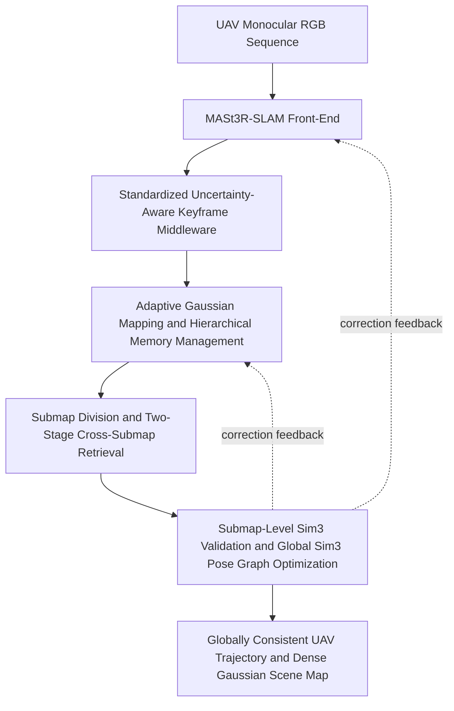
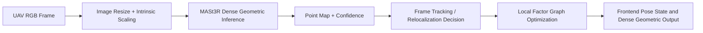
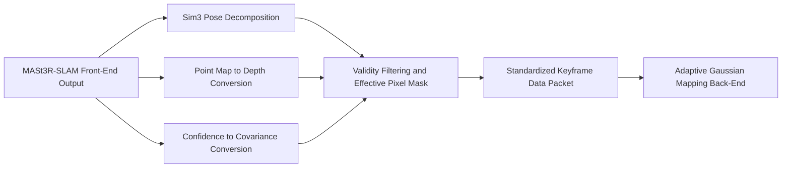
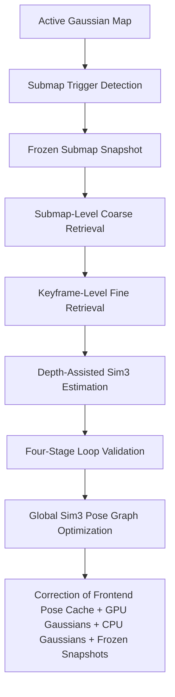

# 1. Title of the Invention

METHOD AND SYSTEM FOR LARGE-SCALE UAV-ORIENTED MONOCULAR SLAM WITH ADAPTIVE GAUSSIAN MAP BASED ON SUBMAP MECHANISM

Applicant: `[To be completed]`

Inventors: `[To be completed]`

Application Type: Invention

Note: This draft is a patent-oriented technical manuscript prepared from the present `DPT-LSG` project direction under the assumption that the MASt3R-SLAM front-end and the submap mechanism are fully adopted in the final system. Filing language, jurisdiction-specific formatting, and claim-scope calibration should be finalized with patent counsel.

## 2. Abstract

The present invention relates to monocular visual simultaneous localization and mapping, dense three-dimensional reconstruction, unmanned aerial vehicle navigation, robotics, and augmented reality, and discloses a method and system for large-scale UAV-oriented monocular SLAM with an adaptive Gaussian map based on a submap mechanism. Existing monocular SLAM systems for large aerial scenes suffer from weak tracking robustness under aggressive motion, motion blur, repetitive roof textures, weakly textured terrain, and large viewpoint variation, and further suffer from tight coupling between tracking and mapping modules, long-term monocular scale drift, insufficient large-scene scalability, and weak global consistency after loop closure. To solve these problems, the invention provides a decoupled end-to-end pipeline comprising a MASt3R-SLAM front-end, a standardized uncertainty-aware keyframe middleware, an adaptive Gaussian mapping back-end, and a submap-based global Sim(3) correction module. The MASt3R-SLAM front-end provides dense point maps, confidence maps, and locally optimized pose states with strong geometric priors suitable for challenging UAV trajectories. The middleware converts front-end confidence into depth uncertainty covariance and packages standardized keyframe data packets. The mapping back-end performs online Gaussian-map initialization, RGB-depth-normal joint optimization, stability-aware pruning and densification, and GPU/CPU hierarchical storage. The submap module divides the global map into active and frozen submaps, performs submap-level coarse retrieval and keyframe-level fine retrieval, validates cross-submap loop candidates by depth-assisted Sim(3) estimation, and optimizes a global Sim(3) pose graph to synchronously correct front-end pose caches and Gaussian map assets. The invention improves tracking robustness, scale consistency, dense mapping accuracy, and real-time large-scale performance for UAV-oriented monocular SLAM.

## 3. Claims

1. A method for large-scale UAV-oriented monocular simultaneous localization and mapping with an adaptive Gaussian map based on a submap mechanism, characterized by comprising:

   S1: acquiring a monocular RGB image sequence captured by an unmanned aerial vehicle and a corresponding camera intrinsic matrix, preprocessing the monocular image, and obtaining a dense point map and a confidence map by means of a MASt3R-SLAM front-end;

   S2: converting the dense point map and the confidence map into a depth map and an uncertainty covariance according to a Sim(3) pose state of the image sequence, performing local pose estimation by factor-graph optimization, and packaging a standardized keyframe data packet;

   S3: initializing and online optimizing an adaptive Gaussian scene map according to the standardized keyframe data packet, performing stability control, pruning, and densification on Gaussian primitives, and implementing GPU/CPU hierarchical storage according to camera-pose distance;

   S4: dividing a global Gaussian map into active submaps and frozen submaps, generating submap descriptors according to keyframe features, and retrieving cross-submap loop-closure candidates by descriptor similarity; and

   S5: performing depth-assisted submap-level Sim(3) similarity-transformation estimation and multi-stage validation on the loop-closure candidates, constructing and optimizing a global Sim(3) pose graph after validation, and feeding an obtained correction transformation back to a front-end pose cache and Gaussian-map assets to obtain a globally consistent camera trajectory and dense scene map.

2. The method according to claim 1, characterized in that preprocessing and MASt3R-SLAM front-end inference in step S1 satisfy:

   $$
   K_{t}^{\prime }=
   \left[
   \begin{array}{ccc}
   s_{x}f_{x} & 0 & s_{x}c_{x}+\Delta _{x}\\
   0 & s_{y}f_{y} & s_{y}c_{y}+\Delta _{y}\\
   0 & 0 & 1
   \end{array}
   \right],
   $$

   and

   $$
   \left(P_{t}, C_{t}\right)=\mathcal{F}_{\theta}^{mast3r}\left(I_{t}', K_{t}'\right),
   $$

   where $P_t$ is the dense point map, $C_t$ is the confidence map, and $\mathcal{F}_{\theta}^{mast3r}$ denotes a MASt3R-SLAM front-end network with a pre-trained geometric prior.

3. The method according to claim 1, characterized in that step S2 satisfies:

   $$
   T_{t}^{sim3}=
   \left[
   \begin{array}{cc}
   s_{t} R_{t} & t_{t} \\
   0 & 1
   \end{array}
   \right],
   \qquad
   s_{t}=
   \left|
   \det\left(T_{t,1:3,1:3}^{sim3}\right)
   \right|^{1/3},
   $$

   $$
   D_{t}(u)=s_{t} Z_{t}(u),
   \qquad
   \Sigma_{t}(u)=
   \operatorname{clip}
   \left(
   \frac{\alpha}{\max \left(C_{t}(u), \varepsilon\right)} s_{t}^{2},
   \Sigma_{min},
   \Sigma_{max}
   \right),
   $$

   $$
   M_{t}(u)=
   \mathbf{1}
   \left[
   D_{min}<D_{t}(u)<D_{max}
   \wedge
   \Sigma_{t}(u)\leq \tau_{\Sigma}
   \wedge
   D_{t}(u), \Sigma_{t}(u)\in \mathbb{R}
   \right],
   $$

   and

   $$
   \mathcal{X}_{t}^{*}=
   \arg \min _{\mathcal{X}_{t}}
   \left(
   \sum_{(i, j) \in \mathcal{E}_{t}^{temp }}
   \rho\left(\left\| r_{i j}^{ray }\left(\mathcal{X}_{t}\right)\right\| _{W_{i j}}^{2}\right)
   +
   \sum_{(i, k) \in \mathcal{E}_{t}^{relocal }}
   \rho\left(\left\| r_{i k}^{relocal }\left(\mathcal{X}_{t}\right)\right\| _{W_{i k}}^{2}\right)
   \right),
   $$

   wherein the standardized keyframe data packet comprises image, depth, covariance, pose, valid-pixel mask, timestamp, global keyframe index, and intrinsic parameters.

4. The method according to claim 1, characterized in that the adaptive Gaussian scene map in step S3 is represented by

   $$
   \mathcal{G}_{t}=
   \left\{
   \gamma_{n}
   \right\}_{n=1}^{N_{t}},
   \qquad
   \gamma_{n}=
   \left(
   \mu_{n}, q_{n}, a_{n}, o_{n}, c_{n}, \kappa_{n}, b_{n}
   \right),
   $$

   and is optimized by a joint loss

   $$
   \mathcal {L}_{t}=
   \lambda _{rgb}\mathcal {L}_{rgb}+
   \lambda _{d}\mathcal {L}_{d}+
   \lambda _{a}\mathcal {L}_{a}+
   \lambda _{n}\mathcal {L}_{n},
   $$

   wherein

   $$
   \mathcal {L}_{rgb}=
   \sum_{u}M_{t}(u)\left\| \hat{I}_{t}(u)-I_{t}'(u)\right\| _{1},
   $$

   $$
   \mathcal {L}_{d}=
   \sum_{u}M_{t}(u)\frac{\left| \hat{D}_{t}(u)-D_{t}(u)\right| }{\Sigma _{t}(u)+\varepsilon },
   $$

   $$
   \mathcal {L}_{a}=
   \sum_{u}M_{t}(u)\left| \hat{A}_{t}(u)-1\right|,
   $$

   $$
   \mathcal {L}_{n}=
   \sum_{u}M_{t}(u)\left(1-\left\langle \hat{N}_{t}(u),N_{t}^{surf}(u)\right\rangle \right).
   $$

5. The method according to claim 1, characterized in that Gaussian stability scoring and hierarchical memory management in step S3 satisfy:

   $$
   \ell _{n}^{imp}\gets \ell _{n}^{imp}+s_{n}^{imp},
   \qquad
   \ell _{n}^{err}\gets \max(\ell _{n}^{err},s_{n}^{err}),
   $$

   and

   $$
   \delta _{i}=
   \left\|
   \operatorname{trans}
   \left(
   (T_{t}^{c2w}) ^{-1}T_{i}^{c2w}
   \right)
   \right\| _{2},
   \qquad
   \mathcal {G}_{t}^{gpu}=
   \{
   \gamma _{n}\mid
   \delta _{\kappa _{n}}\leq \tau _{mem}
   \},
   $$

   $$
   \mathcal {G}_{t}^{cpu}=
   \{
   \gamma _{n}\mid
   \delta _{\kappa _{n}}>\tau _{mem}
   \},
   $$

   so that near-field Gaussian primitives are retained in GPU memory and far-field Gaussian primitives are stored in CPU memory.

6. The method according to claim 1, characterized in that submap division and frozen snapshotting in step S4 satisfy:

   $$
   S_{k}=
   \left(
   \mathcal{V}_{k},
   \mathcal{G}_{k},
   \Omega_{k},
   \overline{\phi}_{k}
   \right),
   $$

   and a submap division trigger condition satisfies

   $$
   \left|\mathcal{V}_{k}\right| \geq N_{max }
   \vee
   \sum_{i=2}^{\left|\mathcal{V}_{k}\right|}
   \left\| p_{i}-p_{i-1}\right\| _{2} \geq L_{max },
   $$

   wherein $\Omega_k$ is a frozen submap snapshot storing Gaussian state, keyframe association, and submap metadata.

7. The method according to claim 1, characterized in that the two-stage cross-submap loop-closure retrieval in step S4 satisfies:

   $$
   \phi _{i}=
   \operatorname{norm}
   \left(
   \left[
   \operatorname{vec}(P(I_{i})),
   \operatorname{vec}(\nabla _{x}\overline {P}(I_{i})),
   \operatorname{vec}(\nabla _{y}\overline {P}(I_{i}))
   \right]
   \right),
   \qquad
   \overline{\phi}_{k}=
   \operatorname{norm}
   \left(
   \frac{1}{\left|\mathcal{V}_{k}\right|}
   \sum_{i \in \mathcal{V}_{k}} \phi_{i}
   \right),
   $$

   $$
   s_{ret }(q, k)=\phi_{q}^{\top} \overline{\phi}_{k},
   \qquad
   s_{ret }(q, j)=\phi_{q}^{\top} \phi_{j},
   $$

   so that a coarse submap-level retrieval stage and a fine keyframe-level retrieval stage are sequentially executed.

8. The method according to claim 1, characterized in that the loop-closure validation and full-link correction feedback in step S5 satisfy:

   $$
   \left(R_{qr}, t_{qr}, s_{qr}\right)=
   \arg \min _{R \in SO(3), t \in \mathbb{R}^{3}, s>0}
   \sum_{m \in \mathcal{I}}
   \left\|
   x_{q}^{(m)}-\left(s R x_{r}^{(m)}+t\right)
   \right\| _{2}^{2},
   $$

   and a four-stage validation rule satisfies

   $$
   \Omega _{val}=
   \left\{
   u\mid
   \hat{A}_{q}(u)>\tau _{acc}
   \wedge
   \hat{D}_{q}(u)>0
   \right\},
   $$

   $$
   e_{photo}=
   \frac{1}{|\Omega _{val}|}
   \sum_{u\in \Omega _{val}}
   \left|
   \hat{I}_{q}^{gray}(u)-I_{q}^{gray}(u)
   \right|,
   $$

   $$
   \chi _{loop}(q,r)=
   \mathbf{1}
   \left[
   |\mathcal{I}|\geq N_{min}
   \wedge
   |\Omega _{val}|\geq A_{min}
   \wedge
   e_{photo}\leq \tau _{photo}
   \wedge
   \left\|
   \hat{p}_{q}-p_{q}
   \right\| _{2}\leq \tau _{jump}
   \right],
   $$

   and

   $$
   \{ S_{i}^{*}\} =
   \arg \operatorname* {min}_{\left\{ S_{i}\right\} }
   \sum _{(i,j)\in \mathcal {E}_{adj}\cup \mathcal {E}_{ov}\cup \mathcal {E}_{loop}}
   \left\|
   \log \left( Z_{ij}^{-1}S_{i}^{-1}S_{j}\right)
   \right\| _{\Lambda _{ij}}^{2},
   $$

   with Gaussian correction satisfying

   $$
   \mu _{n}\leftarrow s_{\Delta _{i}}R_{\Delta _{i}}\mu _{n}+t_{\Delta _{i}},
   \qquad
   q_{n}\leftarrow R_{\Delta _{i}}\otimes q_{n},
   \qquad
   a_{n}\leftarrow a_{n}+\log s_{\Delta _{i}}.
   $$

9. A system for large-scale UAV-oriented monocular simultaneous localization and mapping with an adaptive Gaussian map based on a submap mechanism, characterized by comprising:

   a MASt3R-SLAM front-end module configured to perform step S1 of claim 1;

   a local tracking and standardized keyframe packaging module configured to perform step S2 of claim 1;

   an adaptive Gaussian mapping and hierarchical memory management module configured to perform step S3 of claim 1; and

   a submap management and global Sim(3) correction module configured to perform steps S4-S5 of claim 1.

10. A non-transitory computer-readable storage medium storing computer instructions which, when executed by a processor, cause the processor to perform the method according to any one of claims 1-8.

## 4. Technical Field

The present invention belongs to the technical field of UAV-oriented monocular visual simultaneous localization and mapping (SLAM), dense three-dimensional scene reconstruction, differentiable scene representation, autonomous aerial robotics, and augmented reality, and particularly relates to a large-scale monocular UAV SLAM method and system that employs a MASt3R-SLAM front-end, a standardized uncertainty-aware keyframe middleware, an adaptive Gaussian mapping back-end, and a submap-based global Sim(3) correction mechanism.

## 5. Background Art

Large-scale UAV perception requires stable monocular localization and dense scene reconstruction over long trajectories, rapid attitude variation, large viewpoint baselines, repeated rooftop structures, weakly textured ground regions, and strong motion blur caused by high-speed flight. In such applications, monocular SLAM has advantages in sensor weight, power consumption, and deployment flexibility, while Gaussian splatting provides an efficient differentiable representation for dense three-dimensional mapping and novel-view-consistent rendering.

However, existing technologies still have several substantial limitations.

First, conventional monocular front-ends often have insufficient robustness in aggressive UAV motion and low-texture aerial scenes, resulting in tracking discontinuity, inaccurate geometry, and poor scale consistency over long trajectories.

Second, although MASt3R-SLAM provides a strong dense geometric prior for monocular tracking, it does not by itself solve large-scale dense map organization, long-term memory control, and submap-level global correction for UAV-oriented large-scene operation.

Third, existing monocular dense SLAM systems generally couple the tracking front-end and the mapping back-end too tightly. Confidence produced by the front-end is usually not propagated as explicit uncertainty into dense Gaussian mapping, so unreliable depth regions are not sufficiently suppressed during online optimization.

Fourth, rigid six-DoF loop-closure formulations cannot optimize monocular scale drift, while large-scene retrieval without a submap hierarchy causes rapid growth of search cost and weak real-time performance in aerial mapping.

Fifth, existing Gaussian mapping methods usually lack a complete mechanism that jointly addresses adaptive Gaussian control, active/frozen submap organization, cross-submap loop validation, hierarchical memory management, and full-link correction feedback to all map assets.

Therefore, there remains a need for a large-scale UAV-oriented monocular SLAM method that fully adopts a MASt3R-SLAM front-end, propagates uncertainty into dense mapping, organizes the global map by a submap mechanism, and performs scale-aware Sim(3) global correction over the entire dense mapping pipeline.

## 6. Summary of the Invention

### 6.1 Technical Problems to be Solved

The invention aims to solve the following technical problems.

1. How to improve tracking robustness and geometric reliability for UAV monocular SLAM under aggressive motion, large viewpoint changes, and weakly textured aerial scenes by fully adopting a MASt3R-SLAM front-end.
2. How to realize complete decoupling between tracking and mapping while losslessly propagating front-end confidence into back-end uncertainty-aware dense mapping.
3. How to control the growth of adaptive Gaussian primitives and memory usage during large-scale UAV mapping.
4. How to perform efficient large-scale cross-submap retrieval and loop validation for aerial trajectories.
5. How to eliminate long-term monocular scale drift by submap-level Sim(3) optimization and synchronize the correction to all dense-map assets.

### 6.2 Technical Solution

To solve the above problems, the invention provides a method and system for large-scale UAV-oriented monocular SLAM with an adaptive Gaussian map based on a submap mechanism.

In step S1, a MASt3R-SLAM front-end is adopted as the monocular dense tracking front-end. After image resizing and intrinsic adjustment, the front-end outputs dense point maps, confidence maps, and locally optimized pose states with strong pre-trained geometric priors, thereby improving robustness for UAV trajectories.

In step S2, the dense point map and confidence map are converted into a depth map and an uncertainty covariance according to a Sim(3) pose state. A local factor graph estimates the pose, and the resulting dense observation is packaged into a standardized keyframe data packet, thereby decoupling the MASt3R-SLAM front-end from the Gaussian back-end.

In step S3, the standardized keyframe data packet drives adaptive Gaussian-map initialization and online optimization. The back-end performs differentiable rendering, RGB-depth-normal joint loss optimization, stability-aware pruning and densification, and GPU/CPU hierarchical storage according to pose distance.

In step S4, the global dense map is divided into active submaps and frozen submaps. Keyframe descriptors and submap descriptors are computed, and cross-submap loop candidates are retrieved by a two-stage mechanism including submap-level coarse retrieval and keyframe-level fine retrieval.

In step S5, the system performs depth-assisted submap-level Sim(3) estimation, applies multi-stage validation to loop candidates, constructs a global Sim(3) pose graph, and synchronously feeds the optimized correction back to the front-end pose cache, online GPU Gaussian primitives, CPU-stored Gaussian primitives, and frozen submap snapshots.

### 6.3 Advantageous Effects

Compared with existing technologies, the invention provides the following advantageous effects.

1. By fully adopting the MASt3R-SLAM front-end, the invention provides stronger monocular geometric priors and more robust tracking in UAV-oriented scenes with motion blur, aggressive attitude change, and weak texture.
2. The standardized uncertainty-aware keyframe middleware realizes complete decoupling of the tracking front-end and mapping back-end while preserving lossless propagation of geometric confidence into dense mapping uncertainty.
3. The submap mechanism enables scalable large-scene map organization, frozen dense snapshot management, and efficient cross-submap retrieval for UAV long-range operation.
4. The two-stage retrieval mechanism reduces the computational burden of large-scale aerial loop closure and improves real-time performance over long trajectories.
5. The adaptive Gaussian optimization and hierarchical memory management mechanism suppress uncontrolled growth of Gaussian primitives and improve dense mapping robustness in large-scale UAV scenes.
6. The submap-level 7-DoF Sim(3) optimization fundamentally solves long-term monocular scale drift and synchronously corrects all dense-map assets, thereby achieving full-link global consistency of trajectory and dense map.

## 7. Brief Description of the Drawings

Fig. 1 is an overall flow chart of the proposed large-scale UAV-oriented monocular SLAM method.

Fig. 2 is a schematic diagram of the MASt3R-SLAM front-end architecture.

Fig. 3 is a schematic diagram of the standardized keyframe middleware and uncertainty propagation process.

Fig. 4 is a schematic diagram of submap division, cross-submap loop closure validation, and the global Sim(3) correction mechanism.

### Fig. 1. Overall Flow Chart

### Fig. 2. MASt3R-SLAM Front-End Architecture

### Fig. 3. Standardized Keyframe Middleware and Uncertainty Propagation

### Fig. 4. Submap Division, Loop Validation, and Sim(3) Correction

## 8. Detailed Description of the Embodiments

The invention is further described below in conjunction with preferred embodiments and mathematical expressions. The embodiments are used to explain the invention and shall not be construed as limiting the protection scope of the claims.

### 8.1 S1: MASt3R-SLAM Front-End for UAV-Oriented Monocular Dense Tracking

In the present invention, a monocular RGB sequence $\{I_t\}_{t=1}^{T}$ captured by a UAV is first preprocessed by resizing and cropping. The camera intrinsic matrix is synchronously adjusted so that projection geometry remains consistent after image scaling:

$$
K_{t}^{\prime }=
\left[
\begin{array} {ccc}
{s_{x}f_{x}} & {0} & {s_{x}c_{x}+\Delta _{x}}\\
{0} & {s_{y}f_{y}} & {s_{y}c_{y}+\Delta _{y}}\\
{0} & {0} & {1}
\end{array}
\right].
$$

The front-end fully adopts MASt3R-SLAM as the dense monocular tracking module. The front-end outputs dense geometric observations and confidence:

$$
\left(P_{t}, C_{t}\right)=\mathcal{F}_{\theta}^{mast3r}\left(I_{t}', K_{t}'\right),
$$

where $P_t$ is a dense point map and $C_t$ is a confidence map.

For UAV trajectories, the MASt3R-SLAM front-end is especially advantageous because it provides strong pre-trained geometric priors under:

- rapid translational and rotational motion;
- large altitude and viewpoint variation;
- repetitive roof and road textures;
- low-texture ground or sky-dominant frames; and
- motion blur produced by aerial maneuvering.

In one embodiment, the front-end state can be abstracted as:

$$
\mathcal{S}_{t}^{front}=
\left(
P_{t},
C_{t},
T_{t}^{sim3},
\mathcal{N}_{t},
\mathcal{R}_{t}
\right),
$$

where $T_t^{sim3}$ is a current Sim(3) pose state, $\mathcal{N}_t$ is a local keyframe neighborhood, and $\mathcal{R}_t$ is an optional retrieval/relocalization state.

The MASt3R-SLAM front-end further performs frame tracking and optional relocalization by matching the current frame against temporal or retrieved keyframes and solving a local factor graph. Therefore, the present invention adopts MASt3R-SLAM not as an auxiliary prior only, but as the primary front-end for UAV-oriented dense monocular tracking.

### 8.2 S2: Local Pose Estimation and Standardized Keyframe Packet Generation

The pose state of a current frame is expressed in Sim(3) form:

$$
T_{t}^{sim 3}=
\left[
\begin{array}{cc}
s_{t} R_{t} & t_{t} \\
0 & 1
\end{array}
\right],
\qquad
s_{t}=
\left|
\det\left(T_{t, 1: 3,1: 3}^{sim 3}\right)
\right|^{1 / 3}.
$$

The point map is converted into depth by using the scale term:

$$
D_{t}(u)=s_{t} Z_{t}(u).
$$

The confidence map is propagated as an uncertainty covariance:

$$
\Sigma_{t}(u)=
\operatorname{clip}
\left(
\frac{\alpha}{\max \left(C_{t}(u), \varepsilon\right)} s_{t}^{2},
\Sigma_{min },
\Sigma_{max }
\right).
$$

An effective pixel mask is then constructed as:

$$
M_{t}(u)=
\mathbf{1}
\left[
D_{min }<D_{t}(u)<D_{max }
\wedge
\Sigma_{t}(u) \leq \tau_{\Sigma}
\wedge
D_{t}(u), \Sigma_{t}(u) \in \mathbb{R}
\right].
$$

Invalid pixels are suppressed from subsequent mapping, so front-end confidence is explicitly propagated into the back-end in the form of covariance rather than discarded.

The local pose state is optimized on a factor graph:

$$
\mathcal{X}_{t}^{*}=
\arg \min _{\mathcal{X}_{t}}
\left(
\sum_{(i, j) \in \mathcal{E}_{t}^{temp }}
\rho\left(\left\| r_{i j}^{ray }\left(\mathcal{X}_{t}\right)\right\| _{W_{i j}}^{2}\right)
+
\sum_{(i, k) \in \mathcal{E}_{t}^{relocal }}
\rho\left(\left\| r_{i k}^{relocal }\left(\mathcal{X}_{t}\right)\right\| _{W_{i k}}^{2}\right)
\right),
$$

where $r_{ij}^{ray}$ denotes a geometric ray residual and $r_{ik}^{relocal}$ denotes a relocalization residual.

After optimization, the system generates a standardized keyframe data packet:

$$
\mathcal{B}_{t}=
\left\{
I_{t}',
D_{t},
\Sigma_{t},
M_{t},
T_{t}^{c2w},
\tau_{t},
g_{t},
K_{t}'
\right\}.
$$

This standardized packet is a core inventive step because it completely decouples the MASt3R-SLAM front-end from the adaptive Gaussian mapping back-end while preserving uncertainty information in a lossless and structured form.

### 8.3 S3: Adaptive Gaussian Map Optimization and Hierarchical Memory Management

The dense map is represented by adaptive Gaussian primitives:

$$
\mathcal{G}_{t}=\left\{\gamma_{n}\right\}_{n=1}^{N_{t}},
\qquad
\gamma_{n}=\left(\mu_{n}, q_{n}, a_{n}, o_{n}, c_{n}, \kappa_{n}, b_{n}\right),
$$

where $\mu_n$ is the Gaussian center, $q_n$ is the rotation parameter, $a_n$ is the scale parameter, $o_n$ is opacity, $c_n$ is color, $\kappa_n$ is an ownership keyframe index, and $b_n$ is a birth keyframe index.

For each valid pixel, a Gaussian center may be initialized by back-projection:

$$
x_{t}(u)=D_{t}(u)K_{t}^{'-1}\tilde{u},
\qquad
\mu _{t}(u)=R_{t}x_{t}(u)+t_{t},
$$

where $\tilde{u}=[u,v,1]^{\top}$.

During online optimization, the Gaussian map is rendered into the current view and optimized by an RGB-Depth-Normal joint loss:

$$
\mathcal {L}_{t}=
\lambda _{rgb}\mathcal {L}_{rgb}+
\lambda _{d}\mathcal {L}_{d}+
\lambda _{a}\mathcal {L}_{a}+
\lambda _{n}\mathcal {L}_{n}.
$$

The sub-losses are written as:

$$
\mathcal {L}_{rgb}=
\sum_{u}M_{t}(u)\left\| \hat{I}_{t}(u)-I_{t}'(u)\right\| _{1},
$$

$$
\mathcal {L}_{d}=
\sum_{u}M_{t}(u)\frac{\left| \hat{D}_{t}(u)-D_{t}(u)\right| }{\Sigma _{t}(u)+\varepsilon },
$$

$$
\mathcal {L}_{a}=
\sum_{u}M_{t}(u)\left| \hat{A}_{t}(u)-1\right|,
$$

$$
\mathcal {L}_{n}=
\sum_{u}M_{t}(u)\left(1-\left\langle \hat{N}_{t}(u),N_{t}^{surf}(u)\right\rangle \right).
$$

The invention further introduces adaptive Gaussian stability control:

$$
\ell _{n}^{imp}\gets \ell _{n}^{imp}+s_{n}^{imp},
\qquad
\ell _{n}^{err}\gets \operatorname* {max}(\ell _{n}^{err},s_{n}^{err}).
$$

Pruning and densification can be governed by:

$$
\mathcal{P}_{t}=
\left\{
n \mid
\ell_{n}^{imp}\in [\tau_{p}^{min},\tau_{p}^{max}]
\wedge
\ell_{n}^{err}\leq \tau_{e}
\right\},
$$

$$
\mathcal{D}_{t}=
\left\{
n \mid
\ell_{n}^{err}>\tau_{d}
\vee
\hat{A}_{t}(u)<\tau_{a}
\right\}.
$$

For large-scale UAV operation, hierarchical memory management is introduced:

$$
\delta _{i}=
\left\|
\operatorname{trans}
\left(
(T_{t}^{c2w}) ^{-1}T_{i}^{c2w}
\right)
\right\| _{2},
$$

$$
\mathcal {G}_{t}^{gpu}=
\{ \gamma _{n} \mid \delta _{\kappa _{n}}\leq \tau _{mem}\},
\qquad
\mathcal {G}_{t}^{cpu}=
\{ \gamma _{n} \mid \delta _{\kappa _{n}}>\tau _{mem}\}.
$$

Accordingly, the number of active Gaussian primitives is controlled while preserving local rendering fidelity, which is essential for long-range UAV mapping.

### 8.4 S4: Submap Division and Cross-Submap Loop Closure Candidate Retrieval

The global map is divided into submaps:

$$
S_{k}=
\left(
\mathcal{V}_{k},
\mathcal{G}_{k},
\Omega_{k},
\overline{\phi}_{k}
\right),
$$

where $\mathcal{V}_k$ is a keyframe set, $\mathcal{G}_k$ is a Gaussian set, $\Omega_k$ is a frozen snapshot state, and $\overline{\phi}_k$ is a submap descriptor.

The invention triggers submap division when either a keyframe-count condition or a travel-distance condition is satisfied:

$$
\left|\mathcal{V}_{k}\right| \geq N_{max }
\vee
\sum_{i=2}^{\left|\mathcal{V}_{k}\right|}
\left\| p_{i}-p_{i-1}\right\| _{2} \geq L_{max }.
$$

Once the trigger condition is met, the active submap is frozen into a snapshot:

$$
\Omega_{k}=
\left\{
\mathcal{G}_{k}^{gpu},
\mathcal{G}_{k}^{cpu},
\mathcal{A}_{k}
\right\},
$$

where $\mathcal{A}_k$ stores keyframe association, descriptor information, and submap metadata.

For cross-submap loop closure, the invention employs two-stage retrieval. The keyframe descriptor is:

$$
\phi _{i}=
\operatorname{norm}
\left(
\left[
\operatorname{vec}(P(I_{i})),
\operatorname{vec}(\nabla _{x}\overline {P}(I_{i})),
\operatorname{vec}(\nabla _{y}\overline {P}(I_{i}))
\right]
\right),
$$

and the submap descriptor is:

$$
\overline{\phi}_{k}=
\operatorname{norm}
\left(
\frac{1}{\left|\mathcal{V}_{k}\right|}
\sum_{i \in \mathcal{V}_{k}} \phi_{i}
\right).
$$

The two-stage retrieval scores are:

$$
s_{ret }(q, k)=\phi_{q}^{\top} \overline{\phi}_{k},
\qquad
s_{ret }(q, j)=\phi_{q}^{\top} \phi_{j}.
$$

Thus, the system first retrieves a limited number of candidate submaps and then retrieves a limited number of candidate keyframes inside those submaps. This is especially important for UAV trajectories because aerial loops may span large distances and long time intervals.

### 8.5 S5: Submap-Level Sim(3) Loop Closure Validation, Global Optimization and Full-Link Correction Feedback

This step is the key inventive step of the present invention. Unlike rigid six-DoF loop-closure formulations that correct only rotation and translation, the present invention estimates a seven-DoF Sim(3) transformation and therefore simultaneously corrects rotation, translation, and scale drift in monocular UAV SLAM.

For a retrieved query-reference pair, matched three-dimensional points are reconstructed from depth, and a Sim(3) similarity transformation is estimated by:

$$
\left(R_{qr}, t_{qr}, s_{qr}\right)=
\arg \min _{R \in S O(3), t \in \mathbb{R}^{3}, s>0}
\sum_{m \in \mathcal{I}}
\left\| x_{q}^{(m)}-\left(s R x_{r}^{(m)}+t\right)\right\| _{2}^{2}.
$$

To avoid false loop insertions in large aerial scenes, the invention performs four-stage loop validation.

Stage 1 is correspondence sufficiency:

$$
|\mathcal{I}|\geq N_{min}.
$$

Stage 2 is accumulation-valid area checking:

$$
\Omega _{val}=
\left\{
u\mid
\hat{A}_{q}(u)>\tau _{acc}
\wedge
\hat{D}_{q}(u)>0
\right\},
\qquad
|\Omega _{val}|\geq A_{min}.
$$

Stage 3 is rendered-versus-observed photometric consistency:

$$
e_{photo}=
\frac{1}{|\Omega _{val}|}
\sum_{u\in \Omega _{val}}
\left|
\hat{I}_{q}^{gray}(u)-I_{q}^{gray}(u)
\right|
\leq \tau _{photo}.
$$

Stage 4 is pose-jump consistency:

$$
\left\|
\hat{p}_{q}-p_{q}
\right\| _{2}\leq \tau _{jump}.
$$

The complete loop validation rule is:

$$
\chi _{loop}(q,r)=
\mathbf{1}
\left[
|\mathcal{I}|\geq N_{min}
\wedge
|\Omega _{val}|\geq A_{min}
\wedge
e_{photo}\leq \tau _{photo}
\wedge
\left\|
\hat{p}_{q}-p_{q}
\right\| _{2}\leq \tau _{jump}
\right].
$$

Only validated loop constraints are inserted into a global Sim(3) pose graph:

$$
\{ S_{i}^{*}\} =
\arg \operatorname* {min}_{\left\{ S_{i}\right\} }
\sum _{(i,j)\in \mathcal {E}_{adj}\cup \mathcal {E}_{ov}\cup \mathcal {E}_{loop}}
\left\|
\log \left( Z_{ij}^{-1}S_{i}^{-1}S_{j}\right)
\right\| _{\Lambda _{ij}}^{2}.
$$

Let the optimized correction of node $i$ be:

$$
\Delta _{i}=S_{i}^{*}(S_{i}^{old})^{-1}.
$$

The front-end pose cache is corrected by:

$$
T_{i}^{c2w}\leftarrow \Pi _{SE(3)}\left(\Delta _{i}T_{i}^{c2w}\right),
$$

and Gaussian primitives belonging to the corrected submap or corrected keyframe are updated by:

$$
\mu _{n}\leftarrow s_{\Delta _{i}}R_{\Delta _{i}}\mu _{n}+t_{\Delta _{i}},
\qquad
q_{n}\leftarrow R_{\Delta _{i}}\otimes q_{n},
\qquad
a_{n}\leftarrow a_{n}+\log s_{\Delta _{i}}.
$$

The same correction is synchronously applied to online GPU Gaussian primitives, CPU-stored Gaussian primitives, and frozen submap snapshots. Therefore, the invention realizes full-link global consistency correction across the MASt3R-SLAM front-end state, the online dense map, the hierarchical memory state, and the frozen submap assets.
